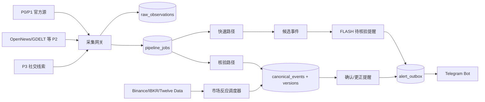

# 0. AI 使用说明

本文件是财经事件雷达 V2.0 的机器可读、可执行的项目事实源。后续 AI Agent 在设计、开发、复核或移交本项目时，应优先读取本文件，再读取当前代码、最新 Gate0 报告和运行状态。不得只依据旧对话或宣传页推断当前状态。

## 0.1 指令优先级

1. 用户当次明确指令。
2. 本文件的安全边界、状态机、接口契约和验收条件。
3. `reports/gate0/latest.json` 与实际运行证据。
4. 源码、测试和数据库迁移。
5. 人读版计划书。
6. V1.0 计划书和历史聊天记录。

## 0.2 非协商边界

- 禁止自动下单、撤单、持仓调整或资金操作。
- IBKR 仅允许只读行情调用；不得请求账户、持仓、执行或订单接口。
- 新加坡服务器仅允许调用 Binance 公共行情端点；不得读取远端量化项目、`.env`、账户数据或交易接口。
- Telegram Bot 仅作为输出渠道；个人账号 MTProto 若未来可用，也只能读取已获授权访问的频道。
- 聚合器 AI 分数只能作为发现特征，不得视为事实或交易指令。
- P2/P3 事件不得直接标记为“已确认”的 S/A 事件。
- 不保存或批量转发受版权保护的新闻全文；默认保存元数据、必要短摘要、哈希和原始链接。
- 密钥不得进入源码、数据库、报告、日志或 Telegram 消息。
- 不以市场波动反向证明新闻为真。

# 1. 项目目标

## 1.1 产品定义

构建一个面向美股、ETF、宏观、商品、外汇与主要加密资产的个人财经事件雷达。系统把分散的官方原文、聚合新闻、社交线索、交易所公告、链上/市场异常和公开行情，转换为可核验、可持续更新、可复盘的事件对象与 Telegram 事件线程。

## 1.2 成功定义

在不新增付费 API、新闻终端、强制云服务或行情订阅的前提下：

- 快速发现预定义的硬事件。
- 对同一事件压缩重复报道。
- 区分事实、来源可信度、事件严重度和逐资产影响。
- 用官方原文或独立可靠来源完成核验。
- 观察而不是臆测市场反应。
- 保存可回放、可标注、可审计的证据链。

## 1.3 非目标

- 自动交易系统。
- 投资建议或仓位建议生成器。
- 机构级超低延迟新闻终端。
- 全网新闻存档或全文再分发平台。
- 依赖一个聚合器或一个行情源的单点系统。
- V1/M1 阶段的完整供应链知识图谱。

# 2. 当前已验证状态

## 2.1 Gate0 结论

Gate0 已满足进入 M1 的最小能力覆盖。最新持久化报告为：

```yaml
gate0_latest:
  report: reports/gate0/latest.md
  run_utc: "2026-07-14T15:55:15Z"
  pass: 12
  warn: 3
  fail: 0
  blocked: 5
  decision: "M1_READY"
```

### 2.1.1 2026-07-16 SEC resilience and second-batch adjudication update

```yaml
historical_research_current:
  first_universe_threads_closed: 139
  second_balanced_queue_rows: 150
  second_balanced_review_threads: 139
  second_batch_rows_with_SEC_scan: 150
  second_batch_threads_adjudicated: 105
  second_batch_threads_remaining: 34
  ranking_uses_post_event_market_outcomes: false

SEC_collection_resilience:
  transient_retry_attempts: 3
  retryable_HTTP_statuses: [429, 500, 502, 503, 504]
  retryable_transport_errors: [URL_error, timeout, connection_error, OS_error, TLS_EOF]
  default_timeout_seconds: 15
  historical_submission_splits_loaded_only_when_recent_window_is_insufficient: true
  latest_cycle_batch:
    offset_start: 125
    rows: 25
    new_filing_candidates: 88
    new_evidence_passages: 48
    aggregate_filing_candidates: 1961
    aggregate_evidence_passages: 1334
    next_offset: 150
    queue_exhausted: true
    evidence_errors: 0
    extraction_errors_before_targeted_retry: 0
    extraction_errors_after_targeted_retry: 0

manual_official_discovery:
  enabled: true
  config: config/active_event_manual_findings.json
  required_candidate_prefix: MANUAL-
  requires_registered_official_evidence: true
  separates_later_terminal_fact_from_earlier_candidate_date: true
  temporal_rule: never_backfill_a_later_legal_event_into_an_earlier_price_candidate

new_boundaries:
  rejected_controls:
    - FARM_cash_merger_delisting
    - TERN_cash_tender_merger_delisting
    - UHG_cash_merger_delisting
    - CWEN_A_one_for_one_Class_C_conversion
    - DNMRQ_market_capitalization_delisting_not_bankruptcy
    - FREHY_periodic_filing_delinquency_delisting_not_bankruptcy
    - LNKB_stock_merger_consideration_delisting
    - GDEN_cash_distribution_and_stock_merger_delisting
    - STKL_cash_arrangement_delisting
    - ESHA_SPAC_trust_redemption_and_dissolution
    - BSFC_minimum_bid_delisting_not_bankruptcy
    - CYTOF_OTCQB_transition_not_bankruptcy
    - LUXH_listing_rule_delisting_not_bankruptcy
    - LFLY_financial_standard_delisting_not_bankruptcy
    - PRLH_SPAC_deadline_delisting_not_bankruptcy
    - CFFS_SPAC_deadline_delisting_not_bankruptcy
    - TCSGQ_December_market_cap_delisting_before_later_bankruptcy
    - BRAC_terminated_SPAC_merger_not_bankruptcy
    - PFTA_SPAC_deadline_delisting_not_bankruptcy
    - MONDQ_December_price_candidate_before_actual_January_Chapter_11
    - CHSN_April_price_candidate_without_contemporaneous_primary_cause
    - ENGC_stockholders_equity_delisting_not_bankruptcy
    - VIRC_interest_coverage_false_positive_no_borrowings_and_covenants_met
    - TTAN_interest_coverage_false_positive_large_liquidity_and_no_outstanding_debt
    - EVE_SPAC_filing_delinquency_and_combination_deadline_not_bankruptcy
    - GHIX_SPAC_cash_trust_redemption_not_bankruptcy
    - MNTN1_SPAC_extension_driven_delisting_not_bankruptcy
    - DUET_minimum_market_value_listing_failure_not_bankruptcy
    - BLEU_SPAC_36_month_deadline_not_bankruptcy
    - MCAG_SPAC_36_month_deadline_with_OTC_continuity_not_bankruptcy
    - PLRZ_June_3_and_June_4_duplicate_price_proxies_after_May_21_notice
    - EWCZ_take_private_cash_merger_delisting_consequence
    - SNMP_2024_vendor_delisting_proxy_after_2023_exchange_determination
    - MAXN_April_30_vendor_and_price_proxies_after_true_legal_events
  verified:
    - AILEQ_voluntary_Chapter_11_A_plus_plus_not_S_without_old_common_outcome
    - MTEM_board_approved_wind_down_A_plus_plus_not_S_without_final_cancellation
    - SGMO_forced_minimum_bid_delisting_A
    - FGL_realized_prepaid_issuance_and_variable_price_note_A_split_proxy_excluded
    - PAVS_realized_ATM_share_expansion_A_split_proxy_excluded
    - AREB_extreme_round_lot_top_up_issuance_A_price_proxy_excluded
    - TCDAQ_pivotal_Phase_3_endpoint_failure_A_price_proxy_excluded
    - ZNB_third_reverse_split_with_convertible_and_warrant_chain_A_split_proxy_excluded
    - WOK_rapid_share_reexpansion_between_two_one_for_100_splits_A_split_proxy_excluded
    - WTO_realized_share_issuance_and_zero_price_warrant_chain_A_split_proxy_excluded
    - YDKG_closed_share_warrant_offering_and_zero_price_warrants_A_split_proxy_excluded
    - MHUAF_proportional_reverse_split_with_authorized_capital_increase_B
    - WOK_first_reverse_split_B_chain_member_excluded
    - LEVGQ_CCAA_and_planned_Chapter_15_A_plus_plus_not_S_without_old_common_outcome
    - AKTSQ_Chapter_11_asset_sale_expected_zero_recovery_A_plus_plus_not_S_without_final_cancellation
    - TFFP_board_approved_dissolution_and_operational_wind_down_A_plus_plus
    - QCLS_convertible_preferred_warrant_financing_chain_A_split_proxy_excluded
    - ATXG_completed_19_percent_share_offering_B_price_consequence_excluded
    - LNZA_reverse_split_with_authorized_capacity_increase_B_no_realized_financing
    - BINI_reverse_split_with_unreduced_authorized_capacity_B_no_realized_financing
    - TCSGQ_confirmed_plan_effective_old_common_cancelled_without_consideration_S
    - CMAXQ_2024_restructuring_support_agreement_A_plus_plus
    - CMAXQ_2025_confirmed_plan_effective_old_common_zero_recovery_S
    - MONDQ_2025_Chapter_11_asset_sale_A_plus_plus
    - KUST_realized_common_prefunded_unit_and_warrant_financing_chain_A
    - CDT_convertible_note_and_warrant_overhang_A
    - ALYAF_voluntary_Nasdaq_exit_with_TSX_listing_retained_B
    - CSTAF_voluntary_NYSE_exit_with_OTCQX_intent_B
    - BHATF_reverse_split_and_minimum_bid_compliance_B
    - AVX_moderate_realized_offering_and_reverse_split_B
    - AIM_reverse_split_for_minimum_price_compliance_B
    - VINOQ_voluntary_Chapter_11_A_plus_plus_without_terminal_old_common_outcome
    - CBIO_reverse_recapitalization_97_percent_ownership_shift_A_split_proxy_excluded
    - ZCAR_common_prefunded_and_reset_warrant_financing_A_split_proxy_excluded
    - ILLMF_voluntary_Nasdaq_exit_with_TSX_continuity_B
    - ITCL_ADR_program_termination_with_Chilean_market_continuity_B
    - XPON_minimum_bid_compliance_reverse_split_B
    - PLRZ_May_21_Nasdaq_discretionary_delisting_determination_A
    - VJTTY_voluntary_Nasdaq_ADS_exit_for_cost_reduction_B
    - NTCOY_secondary_NYSE_exit_with_B3_continuity_B
    - UTRS_voluntary_going_dark_for_cash_conservation_B
    - CIZN_voluntary_Nasdaq_exit_with_OTCQX_continuity_B
    - AENZ_ADS_exit_with_Lima_market_continuity_B
    - BKSC_voluntary_Nasdaq_exit_with_OTCQX_continuity_B
    - SNMP_2023_NYSE_low_price_delisting_determination_A
    - MAXN_April_1_judicial_management_application_A_plus_plus
    - MAXN_April_9_interim_judicial_management_order_A_plus_plus
    - MAXN_April_24_Nasdaq_delisting_determination_A
    - GLOO_going_concern_cash_burn_current_debt_and_no_borrowing_capacity_A
    - BRID_low_cash_negative_operating_cash_flow_and_waived_covenant_violations_A
    - SNBR_unresolved_going_concern_expected_covenant_failure_A_plus_plus
    - AVO_interest_coverage_false_positive_with_positive_equity_and_covenant_compliance_rejected
    - FCEL_twelve_month_liquidity_sufficiency_B
    - JACK_negative_equity_driven_by_treasury_stock_with_liquidity_B
    - SHIM_negative_equity_with_available_liquidity_B
    - AREB_DCX_TNXP_APLM_proportional_or_compliance_reverse_splits_B
    - ZNB_2024_realized_variable_price_convertible_note_and_warrant_chain_A_split_proxy_excluded
    - TRNR_same_week_note_preferred_and_debt_conversion_chain_A_split_proxy_excluded
    - QOMO_public_holder_deficiency_and_SPAC_trust_redemption_not_bankruptcy_rejected
    - CHUC_existing_OTCQB_security_vendor_delisting_mismatch_rejected
    - CLRD_existing_OTCQX_security_stale_delisting_proxy_rejected
    - VCIG_reverse_split_boundary_with_one_day_detector_jitter_B
    - ITOC_speculative_article_and_company_denial_C
    - GENE_share_and_ADS_consolidation_B
    - HCTI_realized_acquisition_financing_and_reset_linked_split_A
    - THTI_true_August_Section_12j_and_trading_suspension_event_A
    - ELOX_true_March_prefunded_warrant_and_debt_conversion_chain_A
    - ATPC_company_denied_undisclosed_cause_for_volatility_rejected
    - RAYA_price_candidate_before_later_offering_rejected
    - ANFIF_stale_OTC_price_after_prior_year_delisting_rejected
    - YGYI_duplicate_price_consequence_after_prior_default_episode_rejected
    - YUANF_no_contemporaneous_primary_event_rejected
    - CRXM_stale_financial_period_in_late_catch_up_filing_rejected
    - OCG_duplicate_price_proxy_for_separately_represented_split_rejected

historical_adjudication_current:
  total: 392
  verified: 236
  rejected_controls: 156

ledger_current:
  schema_version: 12
  canonical_events: 576
  verified: 341
  rejected_controls: 156
  candidates: 79
  sources: 18
  raw_observations: 2176
  source_revisions: 710
  event_evidence: 1479

validation_current:
  tests_passed: 216
  subtests_passed: 17
  audit: PASS
  safety_integrity_violation_categories_nonzero: 0
  trading_enabled: false
  telegram_sent: false

next_execution_order:
  - adjudicate_remaining_21_low_evidence_fundamental_threads
  - require_period_matched_10Q_10K_20F_statement_values_and_sector_context
  - reject_vendor_ratio_or_period_mapping_artifacts_explicitly
  - expand_company_exchange_or_court_sources_only_when_SEC_is_insufficient
  - keep_live_CBIO_Q32_Obsidian_pending_until_actual_closing_evidence
```

`BLOCKED` 表示缺少非必要密钥或权限，不代表已调用失败。M1 不再等待所有候选 API 变成 PASS。

## 2.2 已证明可用的外部链路

| 能力 | 来源 | 当前状态 | 用途 | 限制 |
|---|---|---|---|---|
| 宏观官方事件 | Federal Reserve RSS | PASS | 政策文件、讲话、公告 | 来源发布节奏决定延迟 |
| 宏观官方事件/数据 | BLS RSS / Public Data API | PASS | 就业、CPI 等发布与历史值 | API 无一致预期数据 |
| 公司监管原文 | SEC Submissions API | PASS | 公司申报与监管事实锚点 | 必须保持合规 User-Agent |
| 全球发现 | GDELT DOC API | WARN | 地缘、政策、灾害发现 | 429；低频、缓存、退避 |
| 聚合发现 | OpenNews Free API | MANUAL_PASS | AI、宏观、Web3 热点 | 缓存更新；搜索能力有限 |
| 加密现货行情 | Binance market-data-only REST | PASS | 现货价格 | 仅 Binance 口径 |
| 加密衍生品行情 | Binance USD-M WebSocket | PASS | 成交、标记价、资金费率 | 仅 Binance 合约口径 |
| 加密远程报价 | Singapore SSH public relay | PASS | 公共现货/合约报价 | 只读固定命令，不碰交易程序 |
| 多资产行情 | Twelve Data | PASS | 股票、ETF、FX、加密报价 | 免费额度与刷新频率受限 |
| 私有既有行情权限 | IBKR TWS read-only | PARTIAL_PASS | FX、期货、可授权资产 | AAPL 受行情订阅权限阻塞 |
| 通知输出 | Telegram Bot API | PASS | 事件卡、更新、健康命令 | Bot 不负责个人账号频道监听 |

## 2.3 非阻塞缺口

```yaml
blocked_optional_sources:
  - BEA_API_KEY
  - MARKETAUX_API_TOKEN
  - APCA_API_KEY_ID
  - APCA_API_SECRET_KEY
  - FRED_API_KEY
telegram_mtproto:
  status: blocked_external_registration
  cause: "my.telegram.org/apps generic ERROR"
  impact: "not a core blocker; OpenNews partially covers social/Telegram discovery"
opennews_authenticated_stream:
  status: not_proven
  requirement: OPENNEWS_TOKEN
  role_if_proven: experimental_realtime_P2
```

# 3. NewsLiquid/OpenNews 研究结论与采用决策

## 3.1 已确认的公开架构事实

- OpenNews 对外声称聚合 85+ 来源，分为 news、listing、onchain、meme、market、prediction 六类。
- `opennews-mcp` 是 REST/WebSocket 客户端，核心采集、聚合、去重、授权与模型服务位于 `ai.6551.io` 后端。
- WebSocket 先推 `news.update` 原始新闻，再异步推 `news.ai_update` AI 结果。
- AI 结果可按每个目标资产分别给出 score、signal、grade。
- 用户策略触发至少在分发层使用 NATS；公开文档未证明整个后台都使用 NATS。
- `newsliquid-2.0-flash` 是目标资产感知的窄任务评分器，不是通用聊天模型。
- 公开基准只测试新闻到模型结果的单条处理，不代表来源发布到终端提醒的完整链路，也不代表交易收益。

## 3.2 不可确认的部分

- 各新闻来源的采集协议、授权方式与真实端到端延迟。
- 去重、聚类、修订合并与来源独立性算法。
- 模型参数量、基础模型、训练集、蒸馏/量化方式和部署硬件。
- Bloomberg、Reuters、FT 等来源是否为直接授权数据、公开页面、转载或社交转发。

## 3.3 采用与拒绝

```yaml
adopt:
  - raw_news_first_ai_enrichment_later
  - fast_path_and_verification_path
  - target_asset_specific_impact
  - websocket_or_poll_adapter_abstraction
  - provider_fields_preserved_as_provider_metadata
  - asynchronous_user_updates_by_stable_event_id
reject:
  - provider_score_as_truth
  - one_global_bullish_or_bearish_label_per_event
  - blocking_first_alert_on_full_llm_analysis
  - copying_integrated_trade_execution
  - adding_kafka_or_nats_before_personal_scale_requires_it
```

# 4. 产品与来源原则

## 4.1 来源等级

| 等级 | 定义 | 可做什么 | 不可做什么 |
|---|---|---|---|
| P0 | 监管、法院、统计机构、交易所正式文件 | 确认文件明确陈述的事实 | 超出文件内容推定责任或因果 |
| P1 | 公司 IR、官方新闻稿、正式讲话、项目公告 | 确认主体自身声明 | 替代监管/法院责任认定 |
| P2 | 信誉媒体、聚合 API、记者报道 | 发现、上下文、候选事件 | 单独确认重大事件 |
| P3 | 社交帖子、匿名爆料、二次转述 | 生成线索 | 主动标记 S/A 已确认 |

## 4.2 来源能力矩阵

每类核心能力必须至少有一条 production 路径和一条可描述的 fallback。Source Registry 除原字段外必须增加：

```yaml
required_source_fields:
  - source_id
  - provider_name
  - origin_source
  - independence_group
  - authority_tier
  - capability_tags
  - delivery_mode
  - realtime_mode
  - terms_url
  - robots_policy
  - storage_policy
  - quota
  - backoff_policy
  - parser_version
  - last_success_at
  - latency_slo
  - production
  - experimental
```

`independence_group` 用于避免把 Reuters 原文、媒体转载和 Twitter 转发错误地计为三个独立确认源。

## 4.3 OpenNews 接入规则

```yaml
opennews_free:
  tier: P2
  status: experimental_manual_pass
  endpoints:
    categories: "GET https://ai.6551.io/open/free_categories"
    hot: "GET https://ai.6551.io/open/free_hot?category={category}&subcategory={subcategory}"
  categories: [ai, macro, web3]
  storage: metadata_short_summary_hash_link_only
  provider_score_field: provider_assessment
  confirmation_power: none
opennews_authenticated:
  tier: P2
  status: not_proven
  rest: "https://ai.6551.io/open/news_search"
  websocket: "wss://ai.6551.io/open/news_wss"
  required_env: OPENNEWS_TOKEN
  production_gate: "48h soak + quota/terms review + reconnect/gap recovery test"
```

# 5. V2.0 目标架构

## 5.1 总体原则

数据面负责采集、处理、核验、行情与通知；控制面负责来源配置、健康、配额、版本、重试、回放和审计。M1 使用 `asyncio.Queue + SQLite WAL + durable inbox/outbox`，不引入付费或独立消息基础设施。



## 5.2 组件契约

| 组件 | 输入 | 输出 | 关键约束 |
|---|---|---|---|
| Source Adapter | 外部 RSS/REST/WS/HTML | `RawObservation` | 幂等、限流、不可打印密钥 |
| Ingest Gateway | `RawObservation` | raw row + pipeline job | 先落盘再处理 |
| Lite Normalizer | 原始标题/摘要 | 标准文本、语言、URL、时间 | 不调用大模型 |
| Fingerprinter | 标准文本/实体/时间 | exact hash + event fingerprint | 快速近重判断 |
| Entity Resolver | 标题、来源、字典 | 主体与目标资产候选 | CIK/代码/地址优先 |
| Event Classifier | 事件内容 | event_type、severity、novelty | 不输出全局交易方向 |
| Target Impact Scorer | 事件 + target_asset | direction、impact、horizon、confidence | 每个资产单独评分；允许 abstain |
| Verifier | 候选事件 | facts、credibility、conflicts、status | S/A 使用 P0/P1 或独立交叉验证 |
| Market Scheduler | event + assets + t0 | 多时间窗行情任务 | 处理休市、时区和数据新鲜度 |
| Alert Manager | event version | Telegram message create/edit | 同一事件稳定线程、幂等 outbox |

## 5.3 双速处理

### Fast Path

目标：本地收到新条目后尽快决定是否值得进入观察，而不是完成最终事实判断。

```yaml
fast_path:
  steps:
    - persist_raw
    - normalize_lite
    - canonicalize_url
    - exact_and_near_duplicate_check
    - candidate_entity_resolution
    - event_type_and_severity_candidate
    - target_impact_fast_score
    - optional_flash_alert
  alert_label: "FLASH · 待核验"
  allowed_sources: [P0, P1, P2]
  forbidden_claim: "已确认"
```

### Verification Path

目标：形成可审计的 canonical event、事实版本、来源冲突和正式状态。

```yaml
verification_path:
  steps:
    - cluster_related_observations
    - identify_origin_and_independence_groups
    - retrieve_official_or_primary_source
    - extract_and_validate_facts
    - resolve_conflicts_and_legal_stage
    - create_event_version
    - update_status
    - edit_existing_alert
```

### Market Reaction Path

```yaml
market_windows: [1m, 5m, 15m, 60m, session_close]
default_t0: local_received_at
alternate_t0: source_published_at
required_fields:
  - venue
  - data_scope
  - data_as_of
  - stale_after_seconds
  - benchmark_symbol
  - return
  - abnormal_return
  - scoped_rvol
  - realized_volatility
```

# 6. 状态与时间模型

## 6.1 事件事实状态

```yaml
event_status:
  NEW: "首次捕获，尚未完成最低处理"
  VERIFYING: "存在重要候选，但事实或主体仍需核验"
  CONFIRMED: "P0/P1 或满足独立交叉验证规则"
  DISPUTED: "来源冲突、官方否认或关键事实不一致"
  MARKET_OBSERVED: "市场观察窗已经产生结果；不代表事实确认"
  MONITORING: "等待后续文件、回应、停复牌或趋势"
  RETRACTED: "来源撤回或事件被证伪"
  CLOSED: "事件生命周期结束"
```

## 6.2 处理任务状态

事件事实状态不得与后台处理任务状态混用。

```yaml
job_status: [PENDING, RUNNING, RETRY, DONE, DEAD]
job_stages:
  - INGESTED
  - NORMALIZED
  - FINGERPRINTED
  - ENTITY_RESOLVED
  - FAST_SCORED
  - CLUSTERED
  - VERIFIED
  - MARKET_SCHEDULED
  - ALERTED
```

## 6.3 链路时间戳

```yaml
timestamps:
  source_published_at: "来源标明的发布时间"
  provider_observed_at: "聚合器首次看见；不可得时为空"
  local_received_at: "本系统收到响应或 WS 消息"
  persisted_at: "原始记录提交到 SQLite"
  normalized_at: "轻量规范化完成"
  triaged_at: "快速评分完成"
  confirmed_at: "达到事实确认条件"
  alert_sent_at: "Telegram 成功创建或更新"
  market_observed_at: "指定观察窗行情可用"
```

# 7. 核心数据模型

## 7.1 RawObservation

```json
{
  "observation_id": "src_opennews_3193778",
  "source_id": "opennews_free_macro",
  "provider_name": "opennews",
  "origin_source": "twitter",
  "independence_group": "unknown_until_resolved",
  "authority_tier": "P2",
  "external_id": "3193778",
  "title": "...",
  "summary": "...",
  "canonical_url": "https://...",
  "language": "en",
  "source_published_at": "2026-07-15T15:37:35Z",
  "local_received_at": "2026-07-15T15:38:02Z",
  "content_sha256": "...",
  "provider_assessment": {
    "score": 90,
    "grade": "A+",
    "signal": "long"
  },
  "raw_payload_ref": "raw/opennews/...json"
}
```

## 7.2 CanonicalEvent

```json
{
  "event_id": "evt_20260716_hormuz_001",
  "event_type": "geopolitical_shipping_disruption",
  "title": "霍尔木兹海峡通行再次受阻",
  "severity": "S",
  "credibility": "P2",
  "novelty": "N2",
  "status": "VERIFYING",
  "first_seen_at": "2026-07-15T15:38:02Z",
  "current_version": 2,
  "source_observation_ids": ["src_opennews_3193778"],
  "facts": [],
  "conflicts": [],
  "pipeline_version": "2.0.0"
}
```

## 7.3 AssetImpact

```json
{
  "event_id": "evt_20260716_hormuz_001",
  "target_asset": "CL",
  "relation_type": "MACRO_PROXY",
  "direction": "LONG",
  "impact": 82,
  "horizon": "15m-4h",
  "confidence": 0.76,
  "reason_codes": ["SUPPLY_ROUTE_DISRUPTION"],
  "evidence_urls": ["https://..."],
  "assessment_source": "local_fast_scorer",
  "model_version": "impact-v0.1"
}
```

## 7.4 数据表

```yaml
tables:
  sources: "来源、权限、配额、条款、健康、独立来源组"
  raw_observations: "不可变原始条目与时间戳"
  source_revisions: "同一来源的编辑、删除与修订"
  canonical_events: "稳定事件主体与当前状态"
  event_versions: "每次事实、等级、标题和状态变更"
  event_observations: "事件与原始条目的多对多关系"
  event_facts: "结构化事实、证据句和来源"
  event_conflicts: "冲突、否认与待确认字段"
  entities: "主体、CIK、代码、别名、合约地址"
  assets: "股票、ETF、期货、FX、加密资产主表"
  relations: "PRIMARY/SECTOR/SUPPLIER/CUSTOMER/MACRO_PROXY"
  asset_impacts: "逐资产方向、影响、窗口、置信度"
  market_jobs: "未来观察窗调度"
  market_snapshots: "venue/data_scope/as_of/指标"
  pipeline_jobs: "持久化 inbox、重试、阶段和错误"
  dead_letters: "超过重试阈值的任务"
  alert_outbox: "幂等 Telegram 创建/更新任务"
  alerts: "message_id、版本、发送结果与更正记录"
  model_runs: "输入哈希、模型/规则版本、输出和耗时"
  labels: "人工 hard/weak/rejected 与错误原因"
```

# 8. 事件分级与评分

## 8.1 事件级字段

- `severity`: S/A/B/C，表示事件本身的重要程度。
- `credibility`: P0/P1/P2/P3，表示当前事实证据层级。
- `novelty`: N2/N1/N0，表示是否有新增事实。
- `status`: 表示事实生命周期。

## 8.2 资产级字段

- `target_asset`
- `relation_type`
- `direction`: LONG/SHORT/NEUTRAL/ABSTAIN
- `impact`: 0-100
- `horizon`
- `confidence`
- `reason_codes`
- `assessment_source`

同一事件可以对不同资产产生相反方向。禁止在事件表上保存一个全局 `direction`。

## 8.3 三级模型级联

```yaml
model_cascade:
  stage_0_rules:
    budget_p95_ms: 50
    tasks: [source_tier, keyword_rules, negation, number_checks, exact_hash, obvious_noise]
  stage_1_fast_scorer:
    budget_p95_ms: 500
    budget_p99_ms: 1000
    tasks: [event_type_candidate, severity_candidate, target_impact]
    output: strict_json
    allow_abstain: true
  stage_2_verifier:
    budget: asynchronous
    triggers: [S_or_A, conflicts, ambiguous_entity, legal_stage, low_confidence]
    tasks: [official_source_retrieval, fact_extraction, conflict_resolution, rationale]
```

不得为了模仿 NewsLiquid 的 140ms 宣传指标牺牲来源核验、可解释性或本地稳定性。M1 的优先目标是本地收到消息后的端到端时延，而不是单模型推理时延。

# 9. 去重、聚类与修订

## 9.1 去重层级

1. URL 规范化与外部 ID。
2. 内容 SHA-256 精确去重。
3. 标题规范化与 SimHash/MinHash 近重。
4. `主体 + 动作 + 对象 + 关键数字 + 时间桶` 事件指纹。
5. 语义聚类仅用于候选合并，不可覆盖硬证据。

## 9.2 修订规则

- 同一来源编辑不得生成新事件；写入 `source_revisions`。
- 新金额、新法律阶段、新时间表或官方回应生成 `event_version`。
- 被删除或撤回的帖子保留哈希和删除时间，但 Telegram 必须更新为撤回/争议状态。
- 聚合器多条转载必须追溯 `origin_source` 和 `independence_group`。

# 10. 市场数据与反应

## 10.1 适配器优先级

```yaml
market_adapters:
  crypto_primary: binance_public_ws_rest
  crypto_fallback: singapore_binance_public_relay
  multi_asset_primary: twelve_data
  existing_private_entitlement: ibkr_readonly
  us_equity_future_optional: alpaca_iex_if_keys_available
```

## 10.2 指标

| 指标 | 字段 | 约束 |
|---|---|---|
| 收益 | `return_1m/5m/15m/60m` | 标明 venue、交易对、复权、休市 |
| 异常收益 | `abnormal_return` | 基准缺失不计算，不解释为因果 |
| 来源限定 RVOL | `BINANCE_RVOL/IEX_RVOL` | 名称必须包含数据范围 |
| 实现波动率 | `realized_volatility` | 展示历史分位 |
| 加密衍生品 | funding/OI/liquidation | 仅代表指定交易所/合约 |
| 数据新鲜度 | `data_as_of/stale` | 过期数据禁止显示为实时 |

# 11. Telegram 输出契约

## 11.1 消息类型

1. `FLASH`：快速候选，明确“待核验”。
2. `VERIFIED_UPDATE`：官方/独立来源确认，编辑同一消息。
3. `MARKET_UPDATE`：1/5/15/60分钟市场观察。
4. `CORRECTION`：来源冲突、撤回或事实更正。
5. `DIGEST`：B/C 事件和非紧急更新。
6. `HEALTH`：来源、配额、队列、失败和数据新鲜度。

## 11.2 事件卡必填字段

```yaml
telegram_event_card:
  - event_id
  - version
  - status
  - event_type
  - severity
  - credibility
  - novelty
  - first_seen_at
  - source_published_at
  - capture_lag_if_known
  - source_links
  - affected_assets
  - per_asset_impact
  - market_data_scope
  - next_check
  - research_only_disclaimer
```

`alert_outbox` 使用 `(event_id, event_version, message_type)` 作为幂等键。进程重启不得重复发送相同版本。

# 12. 非功能需求与 SLO

## 12.1 时延

| 指标 | M1 目标 | 说明 |
|---|---:|---|
| 本地持久化 P95 | <= 100ms | `local_received_at` 到 `persisted_at` |
| 快速处理 P95 | <= 2s | `local_received_at` 到 `triaged_at` |
| WebSocket/实时源提醒 P95 | <= 5s | 不含来源或聚合器自身延迟 |
| RSS/轮询 P0 捕获 P95 | <= 120s | 从条目可获取到本地首次捕获 |
| OpenNews Free | 记录分布，不承诺实时 | 缓存/定期更新 |
| S/A 核验耗时 | 按来源记录 | 不以牺牲准确率换统一硬阈值 |

## 12.2 质量

```yaml
quality_targets:
  hard_event_recall: ">= 85%"
  S_A_precision: ">= 90%"
  false_confirmed_S_rate: "<= 2%"
  duplicate_compression: ">= 85%"
  cluster_purity: ">= 95% on frozen test set"
  primary_asset_accuracy: ">= 95%"
  deterministic_metric_correctness: "100%"
  active_alert_traceability: "100%"
```

## 12.3 恢复与观测

- 所有 WS 自动重连并记录断线窗口。
- 支持 REST backfill 或 last_seen 游标补数。
- RSS 使用 ETag/Last-Modified。
- 任务失败指数退避，超过阈值进入 dead letter。
- 每日输出来源成功率、P50/P95 捕获延迟、配额、队列深度、重复率、撤回率、模型耗时和 Telegram 状态。

# 13. 安全与合规

## 13.1 进程隔离

```yaml
processes:
  collector:
    network: external_read_only
    secrets: source_tokens_only
  market_reader:
    network: public_market_data_and_ibkr_readonly
    forbidden: [orders, positions, executions, account]
  event_engine:
    network: optional
    secrets: none_preferred
  notifier:
    network: telegram_bot_api
    secrets: TELEGRAM_BOT_TOKEN
```

## 13.2 必须记录的风险

- OpenNews/GDELT 等聚合器改价、限额或下线。
- 聚合来源名称与真实原始来源/授权不透明。
- Provider AI 分数漂移、更新延迟或缺失。
- WebSocket 断线导致消息缺口。
- RSS/HTML 结构变更。
- 免费美股成交量口径不完整。
- 法律阶段、否定词、数字单位和主体歧义。
- 回测未来信息泄漏。
- 告警疲劳。

# 14. 实施路线

## 14.1 Gate0：完成

退出依据：至少一个官方事件源、一个聚合发现源、一个加密行情源、一个多资产行情源和一个通知渠道已真实返回；没有 FAIL；已知 WARN 有替代路径。

## 14.2 M1：最小流式闭环（当前阶段）

目标链路：

```text
OpenNews Free + SEC/Fed/BLS
→ RawObservation
→ SQLite durable inbox
→ 轻量规范化/指纹/资产候选
→ FLASH/确认事件卡
→ Telegram outbox
```

交付：

- `source_registry` 与 OpenNews Free 适配器。
- 原始记录、pipeline jobs、alert outbox 的迁移。
- 单进程 asyncio worker 和重启恢复。
- 至少一条宏观或监管事件端到端演示。
- 不调用本地大模型也可运行。

退出条件：

- 连续运行48小时。
- 重启不重复推送。
- 可查看每阶段时间戳和错误。
- OpenNews可一键关闭，P0路径仍运行。

## 14.3 M2：事件引擎

- URL/哈希/事件指纹去重。
- canonical event 与 event versions。
- 来源独立性和官方核验。
- S/A/B/C、P0-P3、N2/N1/N0。
- 事件线程更新与更正。

## 14.4 M3：逐资产影响与行情增强

- Entity/Symbol Master。
- `asset_impacts` 每目标资产评分。
- Binance、Twelve Data、IBKR只读适配器统一接口。
- 1/5/15/60分钟市场任务和 venue-scoped 指标。

## 14.5 M4：回放、标注与模型级联

- 冻结事件集和模拟时钟。
- Stage0规则基线。
- Stage1快速评分器。
- Stage2异步核验。
- Provider score 与本地 score 分离评估。

## 14.6 M5：影子运行

- 至少两周，不交易。
- 记录误报、漏报、核验耗时、资产映射、告警疲劳和数据源缺口。
- 达到验收条件后，才纳入日常人工研究。

# 15. 测试策略

## 15.1 必需测试

```yaml
tests:
  adapter_contract:
    - successful_response
    - malformed_payload
    - rate_limit
    - timeout
    - retry_and_backoff
  idempotency:
    - same_external_id
    - same_content_hash
    - restart_recovery
    - duplicate_outbox
  event_engine:
    - exact_duplicate
    - syndicated_duplicate
    - material_update
    - retraction
    - conflicting_sources
  safety:
    - no_order_methods
    - no_secret_logging
    - singapore_relay_public_only
    - ibkr_readonly_only
  market:
    - market_closed
    - stale_data
    - missing_benchmark
    - venue_scope_label
    - no_future_leakage
  telegram:
    - create_once
    - edit_same_event
    - correction
    - retry_without_duplicate
```

## 15.2 冻结评估集

- 事件不少于100条起步，逐步扩展。
- 标签包括 `hard/weak/rejected`、事件类型、主体、严重度、可信度、逐资产方向和影响窗口。
- 最终测试集在阈值调整前冻结。
- OpenNews provider score 可作为弱标签特征，但不得作为人工真值。

# 16. 配置与文件约定

## 16.1 环境变量

```yaml
required_now:
  - SEC_USER_AGENT
  - TELEGRAM_BOT_TOKEN
  - TELEGRAM_CHAT_ID
  - TWELVE_DATA_API_KEY
  - BINANCE_REMOTE_SSH_HOST
  - BINANCE_REMOTE_SSH_PORT
  - BINANCE_REMOTE_SSH_USER
  - BINANCE_REMOTE_SSH_KEY
optional:
  - OPENNEWS_TOKEN
  - BEA_API_KEY
  - MARKETAUX_API_TOKEN
  - APCA_API_KEY_ID
  - APCA_API_SECRET_KEY
  - FRED_API_KEY
  - TELEGRAM_API_ID
  - TELEGRAM_API_HASH
```

## 16.2 目标目录

```text
config/
  sources.yaml
  assets.yaml
  event_types.yaml
data/
  finance_radar.sqlite3
  raw/
reports/
  gate0/
  daily/
  replay/
scripts/
src/finance_radar/
  adapters/
  ingest/
  events/
  entities/
  impact/
  market/
  alerts/
  replay/
tests/
```

# 17. AI Agent 开工协议

后续 AI 接手实现时必须：

1. 先运行 `rg --files` 并阅读本文件、`reports/gate0/latest.md`、相关源码和测试。
2. 不重复向用户索取已配置且已证明可用的凭据。
3. 不把可选 BLOCKED 来源当作 M1 阻塞条件。
4. 先实现一个端到端垂直切片，再扩展来源数量。
5. 每次写入必须有迁移、测试、运行证据和回滚说明。
6. 不修改或调用交易程序。
7. 不把 OpenNews、模型或市场反应写成事实确认源。
8. 完成一个里程碑后更新运行报告，不凭口头说明标记完成。
9. 实时新闻队列较少时不得空等；运行 Sharadar 主动事件发现与 SEC 证据候选流程，维持可审核历史事件积压。
10. 对拟议重组、Chapter 11和退市申诉采用“同期发现窗口 + 最终状态跟踪窗口”；未证明计划生效或旧股最终处置时不得升S。

# 18. 主要研究来源

- NewsLiquid: https://newsliquid.com/
- NewsLiquid 2.0 model brief: https://app.newsliquid.com/blog/newsliquid-2-0-flash.html
- FinTech News Impact Benchmark v1: https://app.newsliquid.com/blog/leaderboard.html
- OpenNews MCP repository: https://github.com/6551team/opennews-mcp
- OpenNews Free API documentation: https://raw.githubusercontent.com/6551team/opennews-mcp/main/openclaw-skill/opennews/SKILL.md
- SEC Developer Resources: https://www.sec.gov/edgar/sec-api-documentation
- Federal Reserve RSS: https://www.federalreserve.gov/feeds/feeds.htm
- BLS Public Data API: https://www.bls.gov/developers/
- Binance Spot Market Data: https://github.com/binance/binance-spot-api-docs
- IBKR TWS API: https://interactivebrokers.github.io/tws-api/

# 19. 最终决策

V2.0 正式采用“多源发现 + 快速候选 + 异步核验 + 逐资产影响 + 市场观察 + 同事件更新”的架构。Gate0 结束，项目进入 M1。OpenNews 免费接口立即作为 experimental P2 发现源接入；认证 REST/WebSocket 在取得 Token 并完成48小时验证后再决定是否 production。任何时候都保持交易隔离与只读行情边界。

# 20. V2.1 主动事件研究补充（2026-07-16）

## 20.1 决策

Finance Radar 不把实时新闻数量少视为停止条件。系统同时维护两条生产路径：

```yaml
live_path:
  input: [OpenNews, SEC, Fed, BLS, Telegram]
  purpose: discover_and_update_current_events
historical_active_path:
  input: D:/short/data/curated/event_candidates.parquet
  enrich: D:/short/data/curated/security_master.parquet
  exclude: D:/short/data/curated/event_label_book_v0.parquet
  purpose: produce_evidence_review_backlog
```

主动历史路径只决定“下一条研究什么”，不使用事后收益排序，也不自动改变标签。

## 20.2 已验证实现

```yaml
implementation:
  discovery_script: scripts/active_event_discovery.py
  sec_evidence_script: scripts/active_sec_evidence.py
  config: config/active_event_research.json
  runbook: ACTIVE_EVENT_RESEARCH.md
validation_2026_07_16:
  queue_rows: 150
  event_families: 5
  event_types: 14
  per_family: 30
  sec_events_requested: 25
  sec_events_with_candidates: 21
  sec_filing_candidates_after_form_filter: 70
  sec_fetch_errors: 0
  strong_form_or_item_matches: 9
  deterministic_queue_hash: true
  tests: 10_passed
```

## 20.3 从 `D:\short` 继承的强制边界

- 采用 S/A++/A/B/C 与 R/L/E/C/P/X，但所有 Sharadar 行仍从 `candidate` 开始。
- 价格暴跌只能提高 `P` 或触发证据搜索，不能证明真实性、合法性或普通股死亡。
- 使用稳定证券标识，不使用当前 ticker 作为主键，不删除退市证券。
- 任何基本面字段必须按 filing/available date 连接，禁止使用期末日期制造未来信息。
- 事件家族和事件类型均衡抽样，避免破产、价格暴跌或负净资产元数据主导队列。
- 当前 `D:\short` Research Candidate V1 存在 metadata dominance 警告；其分数只能作为人工审核辅助，不能直接移植为 Finance Radar 事实或等级。

## 20.4 首批证据裁决形成的新规则

```yaml
adjudicated_examples:
  SOPAQ:
    result: verified_Aplusplus
    reason: Chapter_11_confirmed_but_old_common_cancellation_not_yet_proven
  QVCAQ:
    result: verified_S
    reason: filing_states_old_equity_canceled_for_no_consideration
  FFIC:
    result: rejected_negative_event
    reason: delisting_followed_stock_consideration_merger
```

由此增加以下状态机约束：

1. `bankruptcy_liquidation` 默认进入A++深审，不因事件名称自动成为S。
2. 只有重组计划、法院命令或同等原始证据证明旧股无分配、注销或无恢复，才允许升级S。
3. `delisted` 必须先拆分为 merger、going_private、voluntary、listing_noncompliance、bankruptcy、regulatory_forced。
4. Form 25只证明退市程序；并购换股导致的退市是严重负面事件的拒绝样本。
5. SEC 8-K Item 1.03和Item 3.01是强候选提示，但仍需读取正文和股权处理条款。

## 20.5 下一执行切片

```yaml
next_slice:
  name: evidence_text_extraction_and_import_packet
  tasks:
    - cache_selected_SEC_primary_documents
    - extract_event_specific_evidence_passages
    - classify_support_conflict_irrelevant
    - generate_D_short_label_book_import_packet_without_direct_mutation
    - review_remaining_strong_matches
  acceptance:
    - every_promoted_label_has_primary_url_and_evidence_summary
    - merger_delisting_false_positives_are_rejected
    - S_requires_explicit_common_equity_outcome
    - no_post_event_outcome_in_discovery_rank
    - no_live_trading_or_order_path
```

# 21. V2.2 M1 实时闭环实装状态（2026-07-16）

## 21.1 已完成的真实链路

```yaml
live_vertical_slice:
  discovery:
    adapter: scripts/opennews_free_collector.py
    categories: [macro, ai, web3]
    authority: P2_experimental
    captured_observations: 150
    immutable_source_revisions: 150
  candidate_extraction:
    processor: scripts/live_candidate_extractor.py
    processed: 150
    candidate_observations: 21
    canonical_candidate_threads: 4
    completed_no_candidate: 129
    auto_verification: forbidden
  primary_adjudication:
    importer: scripts/apply_live_primary_adjudications.py
    verified_events: 2
    events:
      - ofac_network_sanctions
      - protocol_incident_trading_paused
  telegram:
    outbox: scripts/telegram_alert_outbox.py
    sent_messages: 2
    kept_message_ids: [3, 5]
    duplicate_cleanup_deleted_message_ids: [2, 4]
    concurrent_delivery_guard: alert_delivery_leases
  validation:
    tests_passed: 23
    no_trading_violations: 0
    auto_verification_violations: 0
```

OpenNews 的 `score/grade/signal` 只保存在原始负载中，不直接决定事件状态、严重度或资产方向。候选只有在人工审核的 P0/P1 证据配置进入账本后，才允许变为 `verified`。

## 21.2 当前真实阻塞

```yaml
telegram_mtproto:
  code_status: ready_and_tested
  runtime_status: blocked
  missing: [TELEGRAM_API_ID, TELEGRAM_API_HASH]
  impact: personal_account_channel_listener_cannot_start
  does_not_block: [OpenNews_collection, official_source_retrieval, Telegram_Bot_output]
market_data:
  twelve_data: pass_multi_asset
  ibkr: connected_but_0_of_3_asset_classes_returned_prices_in_latest_probe
  singapore_binance_ssh: latest_probe_timeout
```

## 21.3 下一优先级

1. 建立 `live_primary_evidence_review` 自动检索器：按事件类型路由 Treasury、SEC、Fed、交易所公告和项目官方账号，但仍由人工确认升级。
2. 增加受影响资产表，严格区分事件主体、受影响资产和宏观代理；禁止把 OpenNews `coins[0]` 当成事件主体。
3. 对新鲜已核验事件启动只读市场观察窗口，保存 `data_as_of/provider/stale`，不接任何下单方法。
4. 将 `collect -> extract -> evidence queue -> outbox` 包装为单实例调度周期，并用数据库租约避免重复运行。
5. 用户取得 Telegram `api_id/api_hash` 后，再启用个人 MTProto 频道监听；在此之前不阻塞主链路。

# 22. V2.3 M1 单周期生产闭环（2026-07-16）

```yaml
entrypoint: scripts/run_live_cycle.py
lease: runtime_leases.live_cycle
stages:
  - opennews_free_collect
  - immutable_raw_and_revision_write
  - conservative_candidate_extraction
  - official_evidence_review_packet
  - reviewed_primary_adjudication
  - explicit_event_entity_asset_relations
  - read_only_market_observation
  - fresh_verified_outbox
  - optional_telegram_delivery
latest_cycle:
  source_items_seen: 150
  new_source_revisions: 0
  new_candidates: 0
  pending_evidence_events: 2
  evidence_routes: 7
  duplicate_alerts: 0
  runtime_lease_released: true
market_snapshots:
  USO: 121.4
  ARB/USD: 0.088600002
  ETH/USD: 1926.45
market_limitations:
  WTI/USD: unavailable_on_configured_twelve_data_free_plan
  provider_timestamp: unavailable_on_price_endpoint
validation:
  tests_passed: 30
  live_event_ticker_misbinding: 0
  non_abstain_asset_impacts: 0
  candidate_market_observation_violations: 0
  no_trading_violations: 0
```

运行说明见 `LIVE_PIPELINE_RUNBOOK.md`。默认命令只执行发现、审核队列和只读行情；仅显式加入 `--send` 才发送新 outbox。该开关不绕过事件新鲜度、已核验状态、A/A++/S 等级和主证据条件。

# 23. V2.4 主动官方事件层（2026-07-16）

## 23.1 已实装来源与降级策略

```yaml
official_active_discovery:
  federal_reserve:
    transport: RSS
    endpoint: https://www.federalreserve.gov/feeds/press_all.xml
    cursor: [ETag, Last-Modified, latest_guid]
    poll_floor_seconds: 300
    category_routing:
      Monetary Policy: monetary_policy
      Enforcement Actions: enforcement_action
      Banking and Consumer Regulatory Policy: bank_regulatory_update
      Other Announcements: ignored_unless_explicit_rule_added
  sec_edgar:
    transport: Atom
    endpoint: latest_filings_owner_excluded_count_100
    cursor: [ETag, Last-Modified, latest_accession]
    accepted_forms: [8-K, 6-K, 10-Q, 10-K, 20-F, NT_10-Q, NT_10-K, 25, 15-12B, 15-12G]
    item_routing:
      Item_1.03: bankruptcy
      Item_2.02: earnings_or_guidance
      Item_2.04: debt_default
      Item_2.05_or_2.06: restructuring
      Item_3.01: delisting
      Item_5.02: management_change
  bls:
    preferred_transport: grouped_Public_Data_API_request
    reason: website_RSS_returns_HTTP_403_from_current_host
    series:
      - CUUR0000SA0
      - WPU00000000
      - CES0000000001
      - LNS14000000
      - JTS000000000000000JOL
    poll_floor_seconds: 5400
    grouped_events: [inflation_release, employment_release]
```

## 23.2 数据契约与安全门

```yaml
schema_version: 11
new_tables: [source_cursors, sec_filing_enrichments, event_review_triage]
official_candidate_contract:
  source_authority: P0_official
  automatic_status: candidate
  automatic_severity_verification: forbidden
  provisional_grade_cap: A_P0_official_candidate
  evidence_relation: official_primary_candidate
  cluster_key: canonical_official_url_plus_event_date
  trading: forbidden
review_gate:
  requires:
    - exact_claim_read
    - materiality_decision
    - event_type_confirmation
    - R_L_E_C_P_X_scores_for_hard_decision
review_triage_contract:
  purpose: rank_manual_review_work_only
  automatic_status_change: forbidden
  automatic_grade_assignment: forbidden
  automatic_asset_direction: forbidden
  no_trading: true
```

P0 表示来源真实性强，不代表事件严重度自动达到 A。官方公告只允许跳过“来源是否伪造”这一层，不能跳过事件含义、法律阶段、股权影响、时间有效性和资产方向审核。

## 23.3 真实运行证据

```yaml
latest_verified_state:
  sources: 8
  raw_observations: 413
  source_revisions: 228
  canonical_events: 222
  official_raw_observations:
    federal_reserve_press: 20
    sec_current_filings: 46
    bls_key_indicators: 4
  official_pending_candidate_events: 68
  pending_live_evidence_events: 70
  source_cursors: 3
  source_cursor_errors: 0
  sec_filing_documents_parsed: 46
  sec_filing_enrichment_errors: 0
  generic_candidates_refined: 4
  negated_machine_matches_repaired: 2
  review_triage_rows: 70
  tests_passed: 45
  audit_result: PASS
  telegram_mode_in_validation: dry_run
safety_counters:
  canonical_no_trading_violations: 0
  impact_no_trading_violations: 0
  non_abstain_asset_impacts: 0
  candidate_market_observation_violations: 0
  candidate_outbox_violations: 0
  auto_verification_violations: 0
  official_auto_promotion_violations: 0
  official_multi_event_cluster_violations: 0
  runtime_leases: 0
  alert_delivery_leases: 0
  review_triage_no_trading_violations: 0
  review_triage_auto_s_violations: 0
  pending_review_without_triage: 0
```

## 23.4 下一执行重点

1. 按 `reports/live_review_triage_latest.md` 的动态队列继续裁决；CBIO、Q32和Obsidian先执行交割状态核验，其余候选明确记录 `accept/revise/reject/defer`，不得由模型自动升级。
2. 继续降低 SEC Item 级粗分类误差，优先区分“真实高管离任 vs 薪酬计划”“股权稀释 vs 债务融资”“实际退市 vs 合规宽限”。
3. 对 Fed/BLS 周期性发布保持“发布值、前值、修订值、市场预期”四字段；没有可信预期源时保持 `N/A`。
4. 连续影子运行 48 小时，统计 SEC 候选精确率、否定语境误报、Fed 分类误差、BLS 周期重复率与端到端延迟。
5. 只有审核准确率稳定后，才扩展更多事件源；当前瓶颈是证据裁决，不是源数量。

# 24. V2.3 证据吞吐与最终状态跟踪（2026-07-16）

## 24.1 当前判断

```yaml
primary_bottleneck: evidence_adjudication_throughput
not_primary_bottleneck: additional_API_count
live:
  pending_review: 23
  primary_text_ready: 20
  score_80_plus: 2
historical:
  queue_rows: 150
  queue_rows_scanned: 150
  unique_review_threads: 129
  sec_filing_candidates: 659
  sec_passage_rows: 464
  events_with_keyword_passage: 131
  review_threads_with_keyword_passage: 121
  adjudicated: 130
  adjudicated_review_threads: 129
  verified: 86
  rejected_controls: 44
  grades:
    S: 6
    Aplusplus: 18
    A: 30
    B: 29
    C: 3
  independent_hard_labels_s_or_aplusplus: 23
  linked_consequence_hard_labels_excluded: 1
ledger:
  schema_version: 12
  canonical_events: 222
  raw_observations: 829
  source_revisions: 282
  event_evidence: 494
  event_chains: 2
  event_chain_members: 5
  verified_events: 135
  rejected_controls: 44
  tests_passed: 139
  test_subtests_passed: 12
  audit_passed: true
  no_trading_violations: 0
  auto_verification_violations: 0
```

## 24.2 双窗口状态机

```yaml
contemporaneous_window:
  range: event_date_minus_10d_to_plus_45d
  purpose: confirm_event_truth_and_initial_state
followup_window:
  range: event_date_to_plus_180d
  applies_to:
    - proposed_restructuring
    - chapter_11_without_final_equity_treatment
    - delisting_appeal_or_relisting_pending
  purpose: resolve_final_legal_and_common_equity_state
  forbidden_uses:
    - discovery_ranking
    - post_event_return_labeling
    - automatic_promotion
cause_resolution_window:
  range: event_date_minus_60d_to_plus_30d
  purpose: distinguish_merger_unit_transition_voluntary_exit_noncompliance_and_bankruptcy
  config: config/active_event_cause_research.json
price_crash_cause_window:
  range: clustered_episode_start_minus_90d_to_plus_45d
  episode_cluster_days: 30
  purpose: find_non_price_primary_cause_before_reviewing_the_market_consequence
  priority_forms: [8-K_item_1.03, 8-K_item_3.01, 6-K, NT_10-Q, 10-Q, 10-K, 20-F]
  pre_event_filing_bonus: true
```

NINEQ 是该状态机的基准样本：初始8-K只证明计划“拟”注销旧股；事件后103天的10-Q证明计划已于3月5日生效，生效日前全部股权（含普通股）无对价注销，新普通股发给票据持有人。只有第二份证据允许从A++边界升为S。

## 24.3 当前实现

```yaml
continuous_cycle:
  script: scripts/run_active_research_cycle.py
  batch_size: 25
  cursor: data/research/active_research_cycle_state.json
  properties: [idempotent_merge, D_short_read_only, no_outcome_ranking, no_trading]
followup:
  config: config/active_event_followup_research.json
  window_days: 180
extraction:
  transient_http_retry: [429, 500, 502, 503, 504]
  ex99_fallback: always_compare_primary_and_ex99_keep_stronger
  targeted_event_filter: repeatable_event_id
  long_passage_anchor: strongest_event_evidence_phrase
quality:
  script: scripts/build_research_quality_report.py
  report: reports/research_quality_latest.md
  gates:
    - primary_evidence_coverage
    - adjudication_coverage
    - verified_vs_rejected_controls
    - hard_label_count_after_review
```

## 24.4 下一执行顺序

1. 历史队列129个独立线程已全部裁决；继续发现新候选时先执行基本面语义防火墙，不把旧队列中的已知伪信号重新送审。
2. 实时端当前34条待审、24条已有一手正文。除 Fermi、Runway、Palmer Square 三条B级融资边界，Glucotrack A级反向并购，以及 Yorkville、Samos 两条C级SPAC低信号边界外，本轮新增 Small Business Bank 显著资本不足及强制整改A++；把 Matson、Home BancShares、TRX Gold的正面经营披露和 Hanover、Infinity 的计划继任/常规董事任命保留为C级反误报对照；把 NextTrip、Nuvve、DBMM、Caro 的现金耗尽与融资依赖裁为A，CDT已实现约51倍股本扩张并伴随现金耗尽裁为A++。Norris虽财务脆弱，但管理层基于80万美元未提款关联方额度认定持续经营疑虑已缓解，因此仅保留为B级边界。Nike普通年报与M&T前员工禁业保留为C级误报对照；Bank of Eufaula前CEO及现任行长的个人执法因揭示治理风险但未证明银行本体损失，分别保留为B级。CPI、PPI和就业报告按真实官方发布日期及量化字段裁为B级宏观事件，变化很小的JOLTS保留为C级；这些等级表达事件重要性，不表达跨资产单一方向。6月17日FOMC声明是主政策事件，经济预测和7月8日纪要是同一会议的支持版本；研究任务组和贴现率会议纪要分别保留为C级行政/文档发布，不重复计作政策冲击。2条80分以上发行候选 CBIO、Q32 仍等待交割确认，Obsidian 也等待7月22日预计交割，不把“签署/定价”提前写成“完成”。所有接受、修改、拒绝、延后决策必须留下证据URL和理由。
3. 对A++未决样本运行180天最终状态跟踪，优先寻找旧股处置、计划生效和法院确认；对退市原因使用-60至+30天因果窗口。
4. 按事件家族统计误报：并购退市、SPAC赎回、反向拆股、负净资产、陈旧价格因果、跨行业比率和季度季节性。
5. 将营收同比低于-100%、毛利率极端跳变、上一季度FCF转负、SPAC/银行/公用事业通用现金短债比挡在候选队列之前；真实持续经营、违约、现金耗尽和融资依赖另行重分类。
6. SEC Item 1.01 必须先按正文区分普通股/权证发行、可转债、普通高级无担保债、信用额度修订、再融资、SPAC IPO/发起人周转借款和真正公司交易；`initial business combination` 等SPAC模板语句不得单独触发并购分类。达到稳定审核精度后再评估新增事件源，行情与事后收益继续仅用于审计和影响观察。
7. SEC持续经营分类必须比较所有正文及EX-99候选片段，优先保留含现金、现金消耗、营运资本、债务到期和融资规模的量化段落；`substantial doubt` 既可能是当前审计结论，也可能出现在“已缓解”的反向语境，最终等级不得由关键词直接决定。
8. BLS公共API只证明“当前最新序列快照”，不提供原始新闻稿发布时间；不得把首次抓取时间冒充官方发布时刻。新快照分别使用季调CPI环比、未季调CPI同比、季调最终需求PPI环比、未季调最终需求PPI同比、非农月增量、失业率和JOLTS水平，正式裁决时再用BLS归档新闻稿补齐真实发布日期。
9. 同一FOMC会议的声明、SEP和三周后纪要属于一个政策事件链：声明是`primary_decision`，SEP是`same_meeting_supporting_projection`，纪要是`followup_version`；任务组、演讲或贴现率会议记录不得凭“Monetary Policy”栏目自动升级成独立政策冲击。
10. `raw_observations` 永远保留首次抓取内容；所有提取、审核路由、实时优先级和SEC增强查询必须通过 `latest_source_content` 读取最新 `source_revisions`。最新修订只改变审核所见内容，不得自动改变事件状态、等级或资产方向。
11. SEC表单项只负责召回，不负责最终语义：8-K/A备考财务修订不得自动视为新业绩，Item 5.02中的董事会委员会任命或激励计划份额调整不得自动视为管理层离职；主文档语义分类必须覆盖宽泛表单标签。

## 24.5 本轮新增反误报规则

```yaml
review_group_key: [stable_security_id, canonical_episode_start, event_family]
sibling_detectors:
  behavior: one_manual_review_thread
  examples: [volume_crash, one_day_crash, five_day_crash, delisted, voluntarydelisting]
price_crash_episode:
  cluster_days_from_first_detector: 30
  fixed_start_window_prevents_indefinite_chaining: true
  representative_row: strongest_primary_evidence_then_queue_rank
  reviewed_member_suppresses_whole_episode: true
price_crash_causality:
  filing_lookback_days: 90
  filing_after_days: 45
  pre_event_primary_filing_priority: true
  item_1_03_bankruptcy_receivership_priority: 55
  item_3_01_delisting_priority: 45
  verified_examples: [PME_OFAC_suspension, SQBGQ_liquidating_plan, FMTOF_warrant_resale, ELOX_cash_exhaustion, SBNY_FDIC_receivership]
  rejected_controls: [WAYS_no_primary_cause, NMGX_mitigating_liquidity_disclosure]
chapter_7:
  separate_from_chapter_11: true
  forbidden_error: treating_title_11_as_chapter_11
  review_ceiling: S_deep_review
cancellation_semantics:
  old_common_receives_new_equity: below_S
  explicit_cash_or_stock_merger_consideration: rejected_negative_delisting
temporal_causality:
  stale_subsidiary_event: P_only_C_control
  cannot_supply: [R, L, E]
reverse_split_context:
  financing_lookback_days: 60
  required_forms: [8-K, 6-K, 10-Q, 424B5, S-1, S-3, F-1, F-3]
  hard_context: [ATM, registered_direct, prefunded_warrant, cashless_warrant, debt_conversion, court_restructuring, repeat_failed_remediation]
  proportional_first_split_without_issuance: B_boundary
negative_equity_context:
  periodic_statement_required: true
  profitable_with_operating_cash_and_buybacks: B_boundary
  treasury_stock_or_capital_return_alone: not_distress
  troubled_debt_plus_cash_burn_plus_dilution: A_review
going_concern_context:
  primary_metrics: [cash, operating_cash_burn, working_capital, current_debt, committed_funding, realized_dilution]
  keyword_is_not_grade: true
  management_alleviated_with_committed_runway: B_boundary
  cash_exhaustion_plus_unfunded_need: A_review
  cash_exhaustion_plus_realized_extreme_dilution: Aplusplus_review
sec_excerpt_selection:
  scan_all_keyword_occurrences: true
  prefer_quantified_material_facts: true
  penalize_item_boilerplate: true
  compare_primary_document_and_exhibits: true
bls_snapshot_semantics:
  source_published_at: null_until_release_page_confirmation
  first_observed_at_is_not_release_time: true
  cpi_series: [CUSR0000SA0, CUUR0000SA0, CUSR0000SA0L1E, CUUR0000SA0L1E]
  ppi_series: [WPSFD4, WPUFD4]
  labor_series: [CES0000000001, LNS14000000, JTS000000000000000JOL]
  market_consensus_without_free_official_source: N/A
fomc_event_chain:
  key: meeting_start_date_and_end_date
  primary_decision: statement
  supporting_versions: [summary_of_economic_projections, meeting_minutes]
  separate_low_signal_controls: [research_task_forces, discount_rate_minutes]
  hard_label_dedup: one_policy_episode
source_revision_read_model:
  immutable_first_capture: raw_observations
  append_only_edits: source_revisions
  latest_read_view: latest_source_content
  consumers: [live_candidate_extractor, live_evidence_review, live_review_triage, sec_filing_enricher]
  automatic_status_or_grade_change: forbidden
event_chain_schema:
  tables: [event_chains, event_chain_members]
  required_primary_count: 1
  roles: [primary_event, same_episode_support, followup_version, consequence, administrative_control]
  audit_checks: [primary_count, primary_pointer, no_trading]
```

## 25. 2026-07-16 主动发现到官方证据闭环

```yaml
current_bottleneck:
  name: primary_evidence_adjudication_throughput
  not_the_bottleneck: [another_broad_market_api, more_unfiltered_news, model_training]
  reason: discovery_arrival_rate_now_exceeds_manual_review_rate

official_discovery_sources_added:
  - {source_id: cftc_enforcement, role: P0_enforcement, initial_lookback_days: 45}
  - {source_id: fda_medwatch, role: P0_product_safety, initial_lookback_days: 14}
  - {source_id: ftc_press, role: P0_competition_consumer_enforcement, initial_lookback_days: 14}
  - {source_id: sec_litigation_releases, role: P0_securities_enforcement, initial_lookback_days: 14}
  - {source_id: sec_trading_suspensions, role: P0_market_integrity, initial_lookback_days: 90}
  - {source_id: fdic_press_releases, role: P0_bank_failure_and_enforcement, initial_lookback_days: 30}

official_primary_page_enrichment:
  script: scripts/official_primary_page_enricher.py
  host_policy: per_source_allowlist
  outputs: [relevant_primary_passage, matched_keywords, passage_score, evidence_status]
  machine_status: machine_extracted_unreviewed
  link_only_status: link_only_no_relevant_passage
  auto_verification_allowed: false
  can_change_event_status: false
  can_assign_grade: false
  can_assign_asset_direction: false

verified_runtime_snapshot:
  date: 2026-07-16
  schema_version: 12
  sources: 16
  raw_observations: 1028
  source_revisions: 509
  event_evidence: 547
  canonical_events: 266
  verified: 158
  rejected_controls: 44
  candidates: 64
  live_pending_manual_review: 44
  live_primary_text_ready: 34
  live_primary_text_ready_pct: 77.3
  tests: 150
  subtests: 17
  audit: PASS
  telegram_sent_in_validation_cycle: 0
  trading_path: absent

next_execution_order:
  - confirm_CBIO_and_Q32_actual_offering_closing
  - adjudicate_material_FTC_enforcement_from_primary_text
  - resolve_SBA_Communications_transaction_meaning
  - confirm_Obsidian_actual_debt_closing
  - adjudicate_remaining_CFTC_FDA_SEC_FDIC_candidates
  - suppress_OpenNews_revision_and_story_cluster_duplicates
  - measure_false_positive_rate_and_time_to_primary_evidence_by_source_family

training_gate:
  blocked_until:
    - stable_event_family_labels
    - enough_rejected_controls_per_family
    - event_time_and_available_time_integrity
    - primary_evidence_coverage_and_reviewer_agreement_measured
  first_model_should_be: routing_or_event_family_classifier
  forbidden_first_model: automatic_severity_or_trading_model
```

## 26. 2026-07-16 latest verified execution state

```yaml
runtime_snapshot:
  schema_version: 12
  sources: 17
  raw_observations: 1029
  source_revisions: 710
  event_evidence: 550
  canonical_events: 266
  verified: 191
  rejected_controls: 44
  candidates_total: 31
  live_pending_manual_review: 3
  historical_pending_evidence_review: 19
  tests: 159
  subtests: 17
  audit: PASS
  telegram_sent_in_latest_cycle: 0
  trading_path: absent

latest_manual_decisions:
  - {event: Happy_City_Holdings_HCHL, grade: A, evidence: SEC_trading_suspension_PDF, boundary: temporary_suspension_not_delisting_and_no_issuer_participation_proven}
  - {event: SBA_Communications_SBAC, grade: B, evidence: SEC_8K_underwriting_agreement, meaning: senior_note_debt_refinancing_pricing_not_generic_corporate_transaction}
  - {event: CENTCOM_MT_Belma, grade: A, evidence: DVIDS_CENTCOM_Public_Affairs, boundary: current_blockade_enforcement_without_assumed_price_direction}
  - {event: BHP_maintained_cost_guidance, action: discovery_filtered, reason: non_negative_aggregated_control_without_contemporaneous_negative_primary_event}

pipeline_repairs:
  - official_PDF_text_extraction_is_optional_and_lazy_loaded
  - factual_paragraphs_outrank_page_titles_and_navigation
  - OpenNews_hash_excludes_provider_clock_score_rank_and_other_volatile_metadata
  - OpenNews_same_URL_and_recognized_entity_story_variants_cluster
  - P2_duplicates_may_support_but_never_override_verified_primary_events
  - SEC_offering_proceeds_used_to_repay_existing_debt_maps_to_debt_refinancing

current_blockers:
  - {event: CBIO, required_fact: actual_offering_closing}
  - {event: Q32, required_fact: actual_offering_closing}
  - {event: Obsidian_Energy, required_fact: actual_debt_closing}

next_execution_order:
  - keep_polling_official_sources_and_OpenNews_discovery_without_sending
  - adjudicate_new_primary_evidence_before_adding_more_broad_aggregators
  - confirm_CBIO_Q32_and_Obsidian_only_after_closing_evidence_exists
  - continue_historical_Sharadar_candidate_research_when_live_queue_is_blocked_on_future_facts
  - measure_source_family_false_positive_rate_primary_evidence_latency_and_duplicate_rate
```

## 27. 2026-07-16 active historical cycle completion

```yaml
historical_cycle:
  queue_rows: 150
  family_balance:
    bankruptcy_or_distress: 30
    delisting_or_suspension: 30
    fundamental_shock: 30
    equity_dilution: 30
    price_crash: 30
  review_threads: 139
  sec_filing_candidates: 1188
  sec_evidence_passages: 774
  threads_with_keyword_passage: 129
  collection_errors: 0
  extraction_errors: 0
  queue_exhausted: true

durable_adjudications:
  rows: 154
  verified: 96
  rejected_controls: 58
  current_queue_threads_adjudicated: 24
  s_or_a_plus_plus_before_chain_dedup: 31
  apply_script: scripts/apply_active_event_adjudications.py
  reviewed_config: config/active_event_adjudication_additions.json
  automatic_label_inference: false

new_boundaries:
  - chapter_7_without_explicit_old_common_outcome_is_below_S
  - chapter_7_boilerplate_in_DIP_default_terms_is_not_actual_conversion
  - old_equity_cancellation_with_cash_or_reorganized_equity_recovery_is_below_S
  - paid_cash_or_stock_merger_delisting_is_rejected_negative_delisting
  - extreme_realized_dilution_may_be_A_plus_plus_but_later_reverse_split_proxy_is_chain_excluded
  - price_crash_may_discover_receivership_or_bankruptcy_but_price_row_stays_chain_excluded

queue_rotation:
  completed_candidate_registry: data/research/active_event_completed_candidates.csv
  completed_thread_registry: data/research/active_event_completed_threads.csv
  exact_candidate_reuse_for_new_batch: 0
  d_short_review_packet_cross_batch_fallback: [stable_id, ticker_at_event, event_date]
  writes_to_D_short: false
  hard_training_enabled: false

ledger_after_import:
  schema_version: 12
  sources: 17
  raw_observations: 1450
  source_revisions: 710
  event_evidence: 860
  canonical_events: 416
  verified: 201
  rejected_controls: 58
  candidates: 157
  no_trading_violations: 0
  automatic_verification_violations: 0
  market_metric_scope_violations: 0

validation:
  tests_passed: 169
  subtests_passed: 17
  audit: PASS
  audit_zero_violation_categories: 19

next_execution_order:
  - adjudicate_remaining_115_current_queue_threads_by_primary_evidence_priority
  - obtain_terminal_old_common_outcomes_before_any_S_promotion
  - convert_repeated_listing_and_bankruptcy_mismatches_into_detector_precision_metrics
  - regenerate_next_balanced_queue_only_after_current_triage_is_empty
  - keep_live_CBIO_Q32_Obsidian_pending_until_actual_closing_evidence
```

## 32. 2026-07-16 price-cause closure and external official evidence registry

```yaml
historical_research_current:
  queue_rows: 150
  review_threads_total: 139
  triage_rows_remaining: 8
  remaining_family: fundamental_shock
  durable_adjudication_rows: 255
  verified_rows: 156
  rejected_control_rows: 99

price_cause_batch:
  reviewed_threads: 10
  verified:
    - WOK_realized_share_and_prefunded_warrant_dilution
    - WTO_share_consolidation_plus_tenfold_authorized_capital_expansion
    - TWG_public_offering_nearly_doubling_share_count
    - IGLDF_court_approved_insolvency_arrangement_and_bond_delisting
    - ECTE_SEC_trading_suspension_for_void_delinquent_issuer
  rejected_controls:
    - NMGX_stale_going_concern_without_contemporaneous_cause
    - RDGT_no_contemporaneous_primary_cause
    - JYD_acquisition_terminations_without_cash_loss
    - LENSF_no_contemporaneous_primary_source_after_deregistration
    - REDFY_no_contemporaneous_primary_source_after_deregistration
  price_observation_can_verify_event: false
  linked_price_consequence_training_eligible: false

external_official_evidence_registry:
  config: config/active_event_external_evidence_additions.json
  accepted_source_classes:
    - official_exchange_issuer_notice
    - regulator_order
    - official_issuer_submission_history
  identity_gate: candidate_id_plus_exact_url
  automatic_label_mutation: false

semantic_guards_added:
  customary_events_of_default_without_actual_occurrence: contract_boilerplate_control
  priced_ordinary_share_offering: dilution_cause_review
  reverse_split_or_share_consolidation_plus_authorized_capital_expansion: structural_dilution_cause_review
  fundamental_evidence_same_score_tie_break: timely_post_period_periodic_filing
  quantified_financial_statement_passage_priority: true

detector_precision_reviewed_yield_pct:
  price_crash_family: 64.3
  volume_crash: 62.5
  one_day_crash: 63.6
  note: linked_price_consequences_are_excluded_from_training

ledger_current:
  schema_version: 12
  canonical_events: 416
  verified: 261
  rejected_controls: 99
  candidates: 56
  sources: 17
  raw_observations: 1706
  source_revisions: 710
  event_evidence: 1130

validation_current:
  tests_passed: 202
  audit: PASS
  safety_integrity_violation_categories_nonzero: 0
  trading_enabled: false
  telegram_sent: false

next_execution_order:
  - adjudicate_remaining_8_revenue_and_gross_margin_threads
  - require_point_in_time_statement_and_event_semantics_not_ratio_only
  - separate_accounting_deficit_from_cash_runway_default_and_financing_dependency
  - use_sector_specific_controls_for_banks_utilities_spacs_and_pre_revenue_issuers
  - search_non_SEC_official_sources_only_when_SEC_evidence_cannot_resolve_the_thread
  - allocate_next_balanced_batch_from_measured_false_positive_taxonomy
  - keep_live_CBIO_Q32_Obsidian_pending_until_actual_closing_evidence
```

## 28. 2026-07-16 active historical adjudication progress

```yaml
historical_research_current:
  queue_rows: 150
  review_threads_total: 139
  review_threads_with_keyword_primary_passage: 129
  review_threads_adjudicated: 55
  review_threads_remaining: 77
  durable_adjudication_rows: 185
  verified_rows: 119
  rejected_control_rows: 66

review_logic_repairs:
  score_derived_grade_is: review_priority_only
  manual_grade_may_conflict_with_rule_grade: true
  conflict_is_preserved_as_boundary_data: true
  cross_batch_price_episode_window_days: 30
  cross_batch_price_siblings_requeued: false
  customary_default_clause_is_actual_default: false
  explicit_no_default_statement_is_distress_evidence: false
  automatic_label_mutation: false

new_review_boundaries:
  - executed_offering_warrant_or_ATM_chain_plus_reverse_split_can_be_A
  - proportional_bid_compliance_reverse_split_without_executed_financing_is_B
  - forced_national_exchange_exit_after_failed_cure_can_be_A
  - voluntary_exit_with_home_exchange_or_OTCQX_continuity_is_B
  - price_move_without_contemporaneous_primary_cause_is_rejected
  - interest_coverage_screen_without_actual_default_is_rejected
  - issuer_or_security_identity_mismatch_is_rejected
  - price_discovered_debt_or_bankruptcy_event_stays_chain_excluded_until_primary_event_date_exists

ledger_current:
  schema_version: 12
  canonical_events: 416
  verified: 224
  rejected_controls: 66
  candidates: 126
  sources: 17
  raw_observations: 1450
  source_revisions: 710
  event_evidence: 860

validation_current:
  tests_passed: 174
  audit: PASS
  no_trading_violations: 0
  automatic_verification_violations: 0
  market_metric_scope_violations: 0

next_execution_order:
  - continue_remaining_77_threads_by_primary_evidence_priority
  - prioritize_dissolution_bankruptcy_forced_delisting_and_realized_dilution
  - keep_Form25_only_rows_unresolved_until_cause_source_is_found
  - derive_detector_precision_metrics_from_rejected_controls
  - regenerate_balanced_queue_only_after_current_triage_is_exhausted
```

## 29. 2026-07-16 evidence gap closure and detector precision

```yaml
historical_research_current:
  queue_rows: 150
  review_threads_total: 139
  review_threads_remaining: 59
  durable_adjudication_rows: 203
  verified_rows: 124
  rejected_control_rows: 79
  sec_evidence_passages: 818

detector_precision_reviewed_yield_pct:
  reverse_split: 98.1
  voluntarydelisting: 100.0
  one_day_crash: 71.4
  volume_crash: 70.0
  bankruptcy_liquidation: 44.8
  delisted: 25.9
  fundamental_shock_family: 30.0

operational_policy:
  reverse_split: retain_discovery_then_separate_proportional_compliance_from_executed_financing
  voluntarydelisting: retain_as_real_boundary_event_without_assuming_negative_equity_outcome
  delisted: require_cause_first_review_for_merger_redemption_voluntary_exit_or_forced_failure
  bankruptcy_liquidation: require_primary_insolvency_or_old_common_evidence_and_keep_source_mismatch_controls
  price_crash: evidence_search_trigger_only_and_linked_proxy_excluded_from_hard_training
  accounting_ratios: context_only_until_primary_text_confirms_default_going_concern_or_financing_dependency
  automatic_label_mutation: false
  trading_enabled: false

ledger_current:
  schema_version: 12
  canonical_events: 416
  verified: 229
  rejected_controls: 79
  candidates: 108
  sources: 17
  raw_observations: 1494
  source_revisions: 710
  event_evidence: 904

validation_current:
  tests_passed: 179
  audit: PASS
  safety_integrity_violation_categories_nonzero: 0

next_execution_order:
  - finish_the_59_remaining_threads_by_evidence_readiness_not_raw_detector_score
  - prioritize_terminal_common_equity_outcomes_and_forced_listing_causes
  - acquire_company_exchange_and_court_sources_for_Form25_only_or_SEC_silent_cases
  - use_detector_precision_to_allocate_the_next_balanced_historical_batch
  - keep_live_CBIO_Q32_Obsidian_pending_until_actual_closing_evidence
```

## 30. 2026-07-16 cause-first delisting closure and periodic-report exhibit coverage

```yaml
historical_research_current:
  queue_rows: 150
  review_threads_total: 139
  triage_rows_remaining: 38
  durable_adjudication_rows: 224
  verified_rows: 140
  rejected_control_rows: 84
  sec_filing_candidates: 1245
  sec_evidence_passages: 885

evidence_pipeline_repairs:
  delisting_pre_event_lookback_days_minimum: 45
  targeted_deepening_refreshes_filing_candidates: true
  ex99_attachment_scan_forms:
    - 8-K
    - 6-K
    - 10-Q
    - 10-K
    - 20-F
  periodic_report_exhibit_regression_test: true
  automatic_label_mutation: false

new_boundary_labels:
  paid_takeover_delisting: rejected_control
  spac_business_combination_deadline_delisting: rejected_control
  voluntary_exit_with_home_market_or_otc_continuity: B
  proportional_reverse_split_without_executed_financing: B
  voluntary_exit_after_active_market_and_coverage_loss: A
  reverse_split_with_executed_financing_and_warrant_chain: A
  forced_bid_price_delisting_with_otc_and_sec_reporting_continuity: A

detector_precision_reviewed_yield_pct:
  reverse_split: 96.7
  voluntarydelisting: 92.9
  delisted: 26.7
  bankruptcy_liquidation: 44.8
  fundamental_shock_family: 30.0

ledger_current:
  schema_version: 12
  canonical_events: 416
  verified: 245
  rejected_controls: 84
  candidates: 87
  sources: 17
  raw_observations: 1549
  source_revisions: 710
  event_evidence: 967

validation_current:
  tests_passed: 185
  audit: PASS
  safety_integrity_violation_categories_nonzero: 0

next_execution_order:
  - resolve_CBDBY_compliance_pressure_versus_ordinary_voluntary_exit
  - adjudicate_SANW_and_EQC_source_mismatch_candidates
  - validate_interest_coverage_on_LTM_debt_service_not_single_quarter_noise
  - keep_price_only_threads_as_discovery_controls_until_contemporaneous_cause_exists
  - continue_company_exchange_court_evidence_search_for_the_remaining_low_evidence_threads
  - keep_live_CBIO_Q32_Obsidian_pending_until_actual_closing_evidence
```

## 31. 2026-07-16 semantic event resolution before source expansion

```yaml
historical_research_current:
  queue_rows: 150
  review_threads_total: 139
  triage_rows_remaining: 31
  durable_adjudication_rows: 232
  verified_rows: 146
  rejected_control_rows: 86
  sec_filing_candidates: 1272
  sec_evidence_passages: 903

highest_priority_architecture_rule:
  objective: resolve_event_truth_and_severity_before_adding_more_broad_sources
  reason: more_sources_amplify_false_positive_semantics_when_event_families_are_not_separated

new_semantic_routes:
  court_insolvency: bankruptcy_boundary
  actual_debt_default_without_petition: debt_default_boundary
  article_9_collateral_disposition: secured_creditor_enforcement_boundary
  cash_distribution_plus_trust_units: cash_returning_liquidation_boundary
  ads_exit_with_home_market_and_ads_continuity: voluntary_listing_exit_B
  explicit_covenant_compliance_and_liquidity: reject_interest_coverage_screen
  deferred_debt_service_and_leverage_tests_with_cash_burn: financing_dependency_A
  negative_equity_with_large_liquidity_buffer: accounting_boundary_B

evidence_selection_policy:
  primary_sort: decision_resolution_rank
  secondary_sort: semantic_review_score
  tertiary_sort: passage_score
  unresolved_high_score_passage_must_not_override_decisive_control: true
  automatic_label_mutation: false

detector_precision_reviewed_yield_pct:
  reverse_split: 96.7
  voluntarydelisting: 93.1
  delisted: 26.7
  bankruptcy_liquidation: 46.7
  interest_coverage_below_1: 11.1
  fundamental_shock_family: 34.3

ledger_current:
  schema_version: 12
  canonical_events: 416
  verified: 251
  rejected_controls: 86
  candidates: 79
  sources: 17
  raw_observations: 1567
  source_revisions: 710
  event_evidence: 985

validation_current:
  tests_passed: 195
  audit: PASS
  safety_integrity_violation_categories_nonzero: 0
  trading_enabled: false
  telegram_sent: false

next_execution_order:
  - adjudicate_remaining_31_threads_by_resolution_evidence_not_detector_score
  - close_price_only_threads_as_controls_unless_a_contemporaneous_primary_cause_exists
  - review_low_evidence_fundamentals_with_sector_and_balance_sheet_context
  - search_company_exchange_court_sources_only_for_threads_still_unresolved_after_SEC
  - allocate_the_next_balanced_batch_using_detector_precision_and_error_taxonomy
  - keep_live_CBIO_Q32_Obsidian_pending_until_actual_closing_evidence
```

## 33. 2026-07-16 first historical universe closure and next bottleneck

```yaml
historical_research_current:
  queue_rows: 150
  review_threads_total_after_sibling_collapse: 139
  adjudicated_review_threads: 139
  adjudicated_review_thread_pct: 100.0
  triage_rows_remaining: 0
  durable_adjudication_rows: 263
  verified_rows: 161
  rejected_control_rows: 102
  hard_labels_S_or_A_plus_plus: 33

final_fundamental_batch:
  reviewed_threads: 8
  verified:
    - VSTM_one_time_COPIKTRA_license_sale_rolloff_boundary_B
    - FIEE_legacy_hardware_revenue_exit_during_SaaS_pivot_A
    - AKTSQ_low_scale_manufacturing_negative_margin_boundary_B
    - ACB_inventory_impairment_driven_reported_margin_collapse_B
    - KRUS_COVID_restaurant_shutdown_operating_shock_A
  rejected_controls:
    - TTE_international_issuer_revenue_field_mapping_error
    - AYTU_official_margin_increase_contradicts_detector
    - CCO_out_of_home_advertising_accounting_field_mismatch

semantic_training_rules:
  reported_metric_is_real_event: false
  one_time_asset_sale_rolloff_requires_recurring_revenue_normalization: true
  inventory_impairment_separate_from_adjusted_unit_economics: true
  low_revenue_manufacturing_ramp_is_boundary_not_insolvency: true
  sector_specific_margin_definition_required: true
  official_period_table_overrides_vendor_mapped_ratio: true

quality_snapshot_fix:
  issue: out_of_queue_adjudicated_sibling_not_counted_as_reviewed_thread
  resolution: align_quality_thread_input_with_triage_thread_input
  regression_test_added: true

ledger_current:
  schema_version: 12
  canonical_events: 416
  verified: 266
  rejected_controls: 102
  candidates: 48
  sources: 17
  raw_observations: 1706
  source_revisions: 710
  event_evidence: 1130

live_current:
  pending_manual_review: 3
  primary_text_ready: 3
  blocker: future_terminal_closing_or_settlement_fact
  repeated_interpretation_of_existing_text: prohibited

validation_current:
  tests_passed: 203
  audit: PASS
  safety_integrity_violation_categories_nonzero: 0
  trading_enabled: false
  telegram_sent: false

next_execution_order:
  - monitor_3_live_candidates_for_terminal_primary_evidence_without_polling_noise
  - generate_next_balanced_auditable_historical_batch_without_future_return_ranking
  - prioritize_low_precision_families_with_explicit_control_taxonomies
  - retain_price_only_signals_as_discovery_inputs_not_truth_labels
  - measure_new_batch_precision_against_102_rejected_controls
```

## 34. 2026-07-16 second historical batch and durable rolling-cycle fixes

```yaml
second_historical_batch:
  queue_rows: 150
  event_families: 5
  rows_per_family: 30
  review_threads_after_sibling_collapse: 139
  adjudicated_threads: 13
  triage_threads_remaining: 126
  post_event_outcomes_used_for_ranking: false
  completed_candidate_overlap: 0
  suspicious_non_common_ticker_suffixes: 0

new_adjudications:
  verified:
    - GOEVQ_chapter_7_liquidation_A_plus_plus_not_S_without_old_common_outcome
    - HYZN_board_adopted_complete_liquidation_plan_A_plus_plus_pending_vote_and_recovery
    - GWAV_reverse_split_for_minimum_bid_compliance_B
    - CERO_equity_deficiency_delisting_and_conditional_financing_A_price_proxy_excluded
    - SOBR_extreme_unit_and_reset_warrant_financing_chain_A_split_proxy_excluded
    - CHSN_realized_share_expansion_and_ATM_inventory_A_split_proxy_excluded
    - WNW_repeat_split_and_variable_zero_price_warrant_financing_A_split_proxy_excluded
    - LBGJ_minimum_bid_compliance_reverse_split_B
  rejected_controls:
    - CTLP_cash_merger_delisting
    - PKST_cash_merger_delisting
    - CTRA_stock_merger_delisting
    - CUK_one_for_one_share_exchange_listing_unification
    - BPTH_stockholders_equity_deficiency_delisting_not_bankruptcy

rolling_cycle_repairs:
  discovery_cli_root_defined: true
  ticker_level_unit_warrant_right_preferred_filter: true
  changed_queue_hash_restarts_offset_at_zero: true
  prior_adjudication_identity_survives_queue_rotation: true
  unseen_replacement_evidence_still_rejected: true

ledger_current:
  schema_version: 12
  canonical_events: 566
  verified: 274
  rejected_controls: 107
  candidates: 185
  sources: 17
  raw_observations: 1893
  source_revisions: 710
  event_evidence: 1167

validation_current:
  tests_passed: 208
  audit: PASS
  safety_integrity_violation_categories_nonzero: 0
  trading_enabled: false
  telegram_sent: false

next_execution_order:
  - research_ZNB_WOK_repeat_reverse_split_history_from_primary_sources
  - close_source_mismatch_threads_with_exact_cause_taxonomy
  - retain_price_only_rows_as_discovery_proxies_unless_contemporaneous_primary_cause_exists
  - expand_low_evidence_fundamental_threads_with_period_matched_SEC_filings
  - keep_live_CBIO_Q32_Obsidian_pending_until_actual_closing_evidence
```

## 35. 2026-07-16 price-proxy closure and fundamental-only queue

```yaml
price_proxy_review_completion:
  reviewed_threads: 13
  verified_events: 4
  rejected_controls: 9
  verified:
    - VCIG_reverse_split_boundary_B_with_exact_date_training_exclusion
    - ITOC_speculative_article_and_company_denial_C
    - GENE_share_and_ADS_consolidation_B
    - HCTI_realized_acquisition_equity_and_price_reset_chain_A
  true_events_discovered_at_separate_dates:
    - THTI_2020_08_24_SEC_Section_12j_and_trading_suspension_A
    - ELOX_2026_03_12_realized_prefunded_warrant_and_debt_conversion_chain_A
  rejected_taxonomies:
    - future_financing_attached_backward
    - stale_exchange_or_financial_period
    - duplicate_price_consequence
    - no_contemporaneous_primary_event
    - official_company_denial_of_undisclosed_cause

second_historical_batch_current:
  review_threads_total: 139
  adjudicated_threads: 118
  remaining_threads: 21
  remaining_family: low_evidence_fundamental
  price_only_threads_remaining: 0

historical_adjudication_current:
  total: 392
  verified: 236
  rejected_controls: 156

ledger_current:
  schema_version: 12
  canonical_events: 576
  verified: 341
  rejected_controls: 156
  candidates: 79
  sources: 18
  raw_observations: 2176
  source_revisions: 710
  event_evidence: 1479

validation_current:
  tests_passed: 216
  subtests_passed: 17
  audit: PASS
  safety_integrity_violation_categories_nonzero: 0
  trading_enabled: false
  telegram_sent: false

next_execution_order:
  - inspect_21_fundamental_threads_by_metric_family_and_filing_period
  - match_each_vendor_metric_to_the_exact_10Q_10K_20F_statement_line
  - distinguish_real_operating_deterioration_from_denominator_sector_and_mapping_artifacts
  - add_non_SEC_primary_sources_only_for_unresolved_foreign_or_exchange_specific_facts
  - rebuild_adjudication_ledger_quality_and_audit_after_each_bounded_batch
  - keep_live_CBIO_Q32_Obsidian_pending_until_actual_closing_evidence
```

## 36. 2026-07-16 full fundamental closure and next research allocation

```yaml
current_historical_universe:
  queue_rows: 150
  unique_review_threads: 139
  adjudicated_review_threads: 139
  triage_threads_remaining: 0
  durable_adjudication_rows: 414
  verified_rows: 250
  rejected_control_rows: 164
  verified_share_pct: 60.4

last_21_fundamental_threads:
  verified_threads: 13
  rejected_threads: 8
  additional_manual_true_event: LYEL_2023_11_07_25_percent_workforce_reduction_B
  negative_equity:
    verified: [LESL_A, COKE_B, CCI_B]
    lesson: negative_equity_requires_cause_and_liquidity_context
  cash_short_debt:
    verified: [SBEV_Aplusplus]
    rejected: [AMPY, AR_2025Q1, AR_2024FY, OBE, LVROF]
    lesson: cash_snapshot_or_working_capital_deficit_is_not_distress_without_cash_burn_default_or_financing_dependency
  revenue_collapse:
    verified: [UROY_B, FDMT_B, CRSP_B, AVHOQ_A, MRSN_B]
    rejected: [LYEL_vendor_proxy]
    lesson: one_time_license_inventory_and_termination_accounting_must_not_be_treated_as_recurring_revenue
  gross_margin_collapse:
    verified: [DRH_A, GCTS_Aplusplus, SURG_A, WATT_A]
    rejected: [SERA, CDZI]
    lesson: reclassify_to_external_shock_or_financing_distress_only_when_primary_facts_support_it_else_reject_tiny_denominator

detector_precision_current:
  reverse_split_accept_pct: 97.8
  voluntary_delisting_accept_pct: 88.6
  generic_delisted_accept_pct: 20.0
  bankruptcy_or_distress_accept_pct: 40.0
  fundamental_shock_accept_pct: 47.7
  cash_short_debt_accept_pct: 5.9
  gross_margin_collapse_accept_pct: 64.7
  revenue_collapse_accept_pct: 50.0
  negative_equity_accept_pct: 100.0
  free_cash_flow_turn_negative_accept_pct: 0.0

quality_report_repair:
  issue: durable_multi_batch_counts_divided_by_current_queue_size_created_percentages_above_100
  fix: scope_passage_and_adjudicated_row_percentages_to_current_queue_while_preserving_durable_totals
  regression_test_added: true

ledger_current:
  schema_version: 12
  canonical_events: 577
  verified: 355
  rejected_controls: 164
  candidates: 58
  sources: 18
  raw_observations: 2187
  source_revisions: 710
  event_evidence: 1489

validation_current:
  tests_passed: 217
  audit: PASS
  safety_integrity_violation_categories_nonzero: 0
  post_event_outcomes_used_for_ranking: false
  trading_enabled: false
  telegram_sent: false

next_execution_order:
  - generate_a_new_balanced_auditable_Sharadar_batch_excluding_all_completed_threads
  - reduce_or_gate_cash_short_debt_and_free_cash_flow_detectors_before_spending_review_capacity
  - preserve_reverse_split_discovery_but_require_financing_or_legal_context_for_severity
  - continue_period_matched_SEC_evidence_extraction_for_fundamental_candidates
  - monitor_CBIO_Q32_and_Obsidian_only_for_actual_closing_evidence
  - keep_D_short_read_only_and_keep_all_market_outcomes_audit_only
```

## 37. 2026-07-16 new balanced batch, terminal-equity truth split and detector hardening

```yaml
new_balanced_historical_batch:
  queue_rows: 150
  family_rows:
    bankruptcy_or_distress: 30
    delisting_or_suspension: 30
    equity_dilution: 30
    fundamental_shock: 30
    price_crash: 30
  unique_review_threads: 140
  sec_scan_complete: true
  sec_candidate_filings: 2511
  sec_keyword_passages: 1622
  keyword_passage_threads: 122
  keyword_passage_coverage_pct: 87.1
  adjudicated_threads_this_batch: 28
  remaining_threads: 112

terminal_equity_truth_split:
  rule: petition_or_plan_proposal_never_receives_S
  S_available_only_on: confirmed_plan_effective_or_other_final_legal_old_common_outcome
  completed_chains:
    - issuer: Enviva
      petition_event: 2024-03-12_Aplusplus
      terminal_event: 2024-12-06_S_old_common_cancelled_no_recovery
    - issuer: Spirit_Airlines
      petition_event: 2024-11-18_Aplusplus
      terminal_event: 2025-03-12_S_old_common_cancelled_no_distribution
    - issuer: Vertex_Energy
      petition_event: 2024-09-24_Aplusplus
      terminal_event: 2025-01-21_S_existing_common_cancelled_and_extinguished
    - issuer: Edgio
      petition_event: 2024-09-09_Aplusplus
      terminal_event: 2025-06-30_S_equity_cancelled_no_recovery
    - issuer: Tupperware
      petition_event: 2024-09-17_Aplusplus
      terminal_event: 2025-06-10_S_liquidation_plan_equity_cancelled_no_distribution
  future_leakage_prevention: terminal_event_is_not_backfilled_to_petition_date

new_false_positive_controls:
  - hypothetical_Chapter_7_liquidation_analysis_is_not_actual_conversion
  - repeated_pending_Chapter_11_status_is_not_a_new_petition
  - bankruptcy_driven_exchange_delisting_is_a_linked_consequence_not_primary_event
  - SPAC_business_combination_deadline_delisting_is_not_bankruptcy
  - paid_merger_delisting_is_not_equity_death
  - voluntary_US_listing_exit_with_home_market_or_OTCQX_continuity_is_B_not_S

pipeline_reliability_repairs:
  sec_batch_cursor:
    partial_error_commits_cursor: false
    successful_retry_required_before_advance: true
  triage_semantics:
    hypothetical_chapter7_bucket: hypothetical_liquidation_control
    pending_case_bucket: stale_bankruptcy_status_control
    linked_listing_bucket: bankruptcy_driven_listing_consequence
  regression_tests_added: 5

historical_adjudication_current:
  total: 452
  verified: 273
  rejected_controls: 179
  S_or_Aplusplus: 61

ledger_current:
  schema_version: 12
  canonical_events: 737
  verified: 378
  rejected_controls: 179
  candidates: 180
  sources: 18
  raw_observations: 2622
  source_revisions: 710
  event_evidence: 1788

validation_current:
  tests_passed: 222
  audit: PASS
  audit_checks: 19
  safety_integrity_violation_categories_nonzero: 0
  post_event_outcomes_used_for_ranking: false
  trading_enabled: false
  telegram_sent: false

next_execution_order:
  - adjudicate_primary_evidence_ready_delisting_dilution_and_source_mismatch_threads
  - raise_keyword_passage_coverage_from_122_of_140_toward_full_coverage
  - use_exact_CIK_security_and_effective_date_alignment_before_accepting_Sharadar_ACTIONS_dates
  - preserve_petition_plan_confirmation_and_terminal_equity_as_separate_event_versions
  - keep_price_only_rows_as_discovery_controls_without_primary_cause
  - rebuild_ledger_quality_audit_and_tests_after_each_bounded_review_batch
  - keep_D_short_read_only_and_never_enable_trading_or_Telegram_send
```

## 38. 2026-07-16 event-time identity and future-information isolation

```yaml
review_progress_current:
  queue_rows: 150
  unique_review_threads: 140
  adjudicated_threads: 34
  remaining_threads: 106
  keyword_passage_threads: 122

new_temporal_identity_controls:
  vendor_date_proxy:
    rule: reject_when_official_effective_date_differs
    replacements:
      ZSPC: 2026-04-28_Nasdaq_trading_suspension_A
      WORX: 2026-04-14_Nasdaq_trading_suspension_A
  event_time_identity:
    rule: current_ticker_or_name_must_not_overwrite_historical_event_identity
    corrections:
      IVPR_backfill: IVP_at_2024_events
      BINI_backfill: MULN_and_Mullen_Automotive_at_2024_event
  later_financing_isolation:
    rule: financing_more_than_30_days_after_reverse_split_is_a_separate_event
    triage_bucket: separate_financing_event
    split_grade_cap: B
    examples:
      IVP_split: 2024-05-08_B
      IVP_offering_close: 2024-07-12_Aplusplus
      SINT_split: 2022-12-20_B
      SINT_offering_close: 2023-02-10_Aplusplus
  severity_boundary:
    GLBS_repeat_reverse_split: A_not_Aplusplus_or_S
    MULN_repeat_split_listing_failure: A_not_terminal_equity_death

historical_adjudication_current:
  total: 464
  verified: 281
  rejected_controls: 183
  S_or_Aplusplus: 63

ledger_current:
  schema_version: 12
  canonical_events: 743
  verified: 386
  rejected_controls: 183
  candidates: 174
  sources: 18
  raw_observations: 2635
  source_revisions: 710
  event_evidence: 1797

validation_current:
  tests_passed: 223
  audit: PASS
  audit_checks: 19
  safety_integrity_violation_categories_nonzero: 0
  D_short_read_only: true
  post_event_outcomes_used_for_ranking: false
  trading_enabled: false
  telegram_sent: false

next_execution_order:
  - adjudicate_the_106_remaining_threads_by_primary_evidence_readiness
  - preserve_event_time_CIK_ticker_name_and_official_effective_date
  - split_later_financing_from_earlier_corporate_actions
  - raise_keyword_passage_coverage_above_122_of_140
  - rebuild_ledger_quality_audit_and_tests_after_each_bounded_batch
  - never_write_D_short_or_enable_trading_or_Telegram_send
```

## 39. 2026-07-16 reverse-split causal decomposition continuation

```yaml
review_progress_current:
  queue_rows: 150
  unique_review_threads: 140
  adjudicated_threads: 42
  remaining_threads: 98
  historical_adjudications: 478
  verified: 292
  rejected_controls: 186

causal_decomposition_examples:
  BNED:
    2024-06-10_recapitalization:
      grade: Aplusplus
      facts:
        legacy_common_shares: 53156369
        private_placement_shares: 1925343642
        post_transaction_pre_split_shares_approx: 2620500000
        legacy_share_pct_approx: 2.0
        additional_components: [rights_offering, 34m_debt_conversion, 95m_new_equity_capital]
    2024-06-12_reverse_split:
      grade: B
      role: linked_split_mechanics_dedup_excluded
  CISS:
    post_split_common: 1953029
    post_split_warrant_coverage: 3211450
    warrant_to_common_pct_approx: 164
    derivative_terms: [surrounding_lowest_VWAP_reset, alternative_cashless_exercise]
    grade: A
    Aplusplus_withheld_because: exercise_and_resulting_issuance_not_proven
  XTIA:
    2024-03-12_reverse_merger:
      XTI_holder_fully_diluted_ownership_pct: 75
      converted_XTI_notes_usd_approx: 7535701
      grade: A
    2024-03-13_split_adjusted_trading:
      grade: B
      role: linked_split_mechanics_dedup_excluded
  SIDU:
    2023-12-20_compliance_split: B
    2024-02-01_offering_close:
      common_shares: 1181800
      prefunded_warrants: 69900
      representative_warrants: 62585
      legacy_common_pct_after_base_approx: 44
      grade: A

date_and_identity_corrections:
  CYN_vendor_2024-07-05: replaced_by_2024-07-03_legal_effective_B
  UCAR_vendor_2024-04-03: replaced_by_2024-04-01_Nasdaq_reflected_B
  BINI_2023_backfill: replaced_by_Mullen_Automotive_MULN_2023-12-21_A

ledger_current:
  schema_version: 12
  canonical_events: 749
  verified: 397
  rejected_controls: 186
  candidates: 166
  sources: 18
  raw_observations: 2648
  source_revisions: 710
  event_evidence: 1806

validation_current:
  tests_passed: 223
  audit: PASS
  audit_checks: 19
  safety_integrity_violation_categories_nonzero: 0
  D_short_read_only: true
  trading_enabled: false
  telegram_sent: false

next_execution_order:
  - adjudicate_remaining_reverse_split_threads_with_contemporaneous_derivative_context
  - adjudicate_primary_evidence_ready_delisting_threads
  - restore_event_time_identity_before_any_severity_decision
  - separate_split_merger_financing_and_market_consequence_timestamps
  - raise_keyword_passage_coverage_above_122_of_140
  - rebuild_all_quality_and_safety_artifacts_after_each_bounded_batch
```

## 40. 2026-07-16 event-time identity and causal-chain decomposition

```yaml
review_progress_current:
  queue_rows: 150
  unique_review_threads: 140
  adjudicated_threads: 49
  remaining_threads: 91
  historical_adjudications: 494
  verified: 303
  rejected_controls: 191
  trainable_S_or_Aplusplus: 65

identity_corrections:
  JBIO_2024_backfill: AVTE_Aerovate_Therapeutics
  LIANY_2024_backfill: LIAN_LianBio
  VBIO_2023_backfill: TIVC_Tivic_Health
  CHAI_2023_backfill: SYTA_Siyata_Mobile
  DVLT_2023_backfill: WISA_WiSA_Technologies
  rule: reject_current_identity_on_historical_row_and_create_event_time_manual_record

causal_decomposition_examples:
  GNLN:
    2025-04-23_resettable_series_B_warrants_exercisable: A
    2025-04-24_price_dislocation: C_linked_consequence_dedup_excluded
    2025-05-05_Nasdaq_Rule_5101_determination: A
  AVTE:
    2024-06-17_phase2b_primary_endpoint_failure: Aplusplus
    downstream_shutdowns: [phase3, long_term_extension]
    S_withheld_because: approximately_100m_cash_and_no_terminal_common_equity_outcome
  LIAN:
    2024-02-13_wind_down_asset_sales_and_cash_return: B
    2024-03-15_price_move: rejected_mechanical_ex_dividend_adjustment
    cash_dividend_per_ADS_usd: 4.80
  WISA:
    2023-01-18_Nasdaq_low_price_delisting_determination: A
    2023-01-27_one_for_100_compliance_split: B
    2023-02-03_common_prefunded_private_warrant_financing: A

ledger_current:
  schema_version: 12
  canonical_events: 758
  verified: 408
  rejected_controls: 191
  candidates: 159
  sources: 18
  raw_observations: 2666
  source_revisions: 710
  event_evidence: 1816

validation_current:
  tests_passed: 223
  audit: PASS
  audit_checks: 19
  safety_integrity_violation_categories_nonzero: 0
  D_short_read_only: true
  trading_enabled: false
  telegram_sent: false

next_execution_order:
  - adjudicate_the_91_remaining_threads_by_primary_evidence_readiness
  - restore_event_time_CIK_ticker_and_company_before_severity_scoring
  - reject_ex_dividend_and_other_mechanical_price_adjustments_as_event_proxies
  - keep_price_consequence_split_financing_delisting_and_clinical_failure_timestamps_separate
  - require_terminal_common_equity_evidence_for_S
  - rebuild_ledger_quality_audit_tests_and_plan_artifacts_after_each_bounded_batch
```

## 41. 2026-07-16 delisting-cause, consideration and event-time classification

```yaml
review_progress_current:
  queue_rows: 150
  unique_review_threads: 140
  adjudicated_threads: 59
  remaining_threads: 81
  historical_adjudications: 512
  verified: 311
  rejected_controls: 201
  trainable_S_or_Aplusplus: 65

delisting_classification_rules:
  required_questions:
    - whether_cash_stock_or_other_merger_consideration_exists
    - whether_the_same_security_or_economic_interest_continues_on_another_primary_exchange
    - whether_only_a_US_ADR_or_ADS_listing_is_being_removed
    - whether_vendor_date_and_ticker_match_the_legal_effective_event
  identity_rule: use_event_time_exchange_ticker_and_preserve_later_OTC_symbol_as_alias_only
  severity_rule: delisting_text_alone_never_proves_terminal_common_equity_loss

paid_merger_controls:
  EM:
    candidate_date: 2026-04-28
    outcome: rejected_delisting_proxy
    consideration: USD_1.25_cash_per_non_excluded_ADS
  MRCC:
    candidate_date: 2026-04-14
    outcome: rejected_delisting_proxy
    consideration: 0.9402_HRZN_shares_per_MRCC_share

verified_B_delisting_events:
  SEAC_2023-08-28: going_dark_cost_savings_and_uncertain_OTC_liquidity
  BNSO_2023-07-11: going_dark_below_300_record_holders_and_thin_trading
  ABB_2023-05-23: US_ADR_exit_with_Swiss_and_Stockholm_listings_continuing
  DTEA_2023-04-14: Nasdaq_exit_with_TSXV_transfer_after_bid_price_deficiency
  CAJ_2023-03-06: US_ADR_exit_with_Japan_listings_and_OTC_continuation
  PTNR_2023-02-16: Nasdaq_exit_with_TASE_sole_listing_and_ADR_continuation
  CEA_2023-02-03: US_ADS_exit_with_Hong_Kong_and_Shanghai_listings_continuing
  ZNH_2023-02-03: US_ADS_exit_with_Hong_Kong_and_Shanghai_listings_continuing

ledger_current:
  schema_version: 12
  canonical_events: 766
  verified: 416
  rejected_controls: 201
  candidates: 149
  sources: 18
  raw_observations: 2683
  source_revisions: 710
  event_evidence: 1832

validation_current:
  tests_passed: 223
  audit: PASS
  audit_checks: 19
  safety_integrity_violation_categories_nonzero: 0
  D_short_read_only: true
  trading_enabled: false
  telegram_sent: false

next_execution_order:
  - adjudicate_24_source_mismatch_bankruptcy_threads_with_existing_evidence_routes
  - resolve_the_18_threads_without_keyword_passages
  - separate_SPAC_lifecycle_Form_25_and_actual_insolvency
  - require_petition_or_equivalent_primary_evidence_before_bankruptcy_grade
  - rebuild_ledger_quality_audit_tests_and_plan_artifacts_after_each_bounded_batch
```

## 42. 2026-07-16 source-mismatch closure and tail-review execution state

```yaml
review_progress_current:
  queue_rows: 150
  unique_review_threads: 140
  adjudicated_threads: 83
  remaining_threads: 57
  source_mismatch_review_remaining: 0
  historical_adjudications: 547
  verified: 323
  rejected_controls: 224
  trainable_S_or_Aplusplus: 69

source_mismatch_rules_now_enforced:
  identity:
    - event_time_ticker_CIK_and_security_must_match
    - later_OTC_alias_is_metadata_not_historical_identity
    - target_company_event_must_not_propagate_to_SPAC_issuer
  time:
    - announcement_date_is_not_automatically_legal_effective_date
    - future_insolvency_must_not_backfill_earlier_price_or_listing_rows
    - petition_plan_effective_date_and_old_common_outcome_are_distinct_events
  family:
    - SPAC_trust_redemption_is_not_bankruptcy
    - Form_25_or_delisting_consequence_is_not_a_new_bankruptcy
    - voluntary_listing_exit_forced_delisting_receivership_administration_and_dissolution_are_separate_families

verified_examples:
  LILM_2024-10-28: principal_German_operating_subsidiaries_self_administration_insolvency_Aplusplus
  VEV_2024-10-21: court_receiver_over_all_assets_Aplusplus
  GENE_2024-11-20: Australian_voluntary_administration_after_failed_raise_Aplusplus
  BGXX_2025-02-22: prepackaged_Chapter_11_with_nonterminal_common_Aplusplus
  CAPT_2026-04-09: Nasdaq_panel_delisting_after_20F_deadline_failure_A
  AAMC_2024-09-16: voluntary_NYSE_American_exit_with_OTC_continuity_B
  PIXY_2022-09-01: one_for_100_reverse_split_mechanics_B
  DXI.H_2020-09-11: one_for_100_consolidation_and_name_change_B

hard_negative_examples:
  SPAC_trust_redemption_controls: [BCSA, NPAB, GAQ, ONYX, SEDA, ADRT, HHGC, BACA]
  later_ticker_identity_proxies: [AAMCF, CPTAF, DXIEF, BGXXQ]
  future_or_wrong_family_proxies: [GENE_2024-10-16, GHSI_2024-10-11, SMFL_2024-09-18]

ledger_current:
  schema_version: 12
  canonical_events: 777
  verified: 428
  rejected_controls: 224
  candidates: 125
  sources: 18
  raw_observations: 2713
  source_revisions: 710
  event_evidence: 1858

validation_current:
  tests_passed: 223
  audit: PASS
  audit_checks: 19
  safety_integrity_violation_categories_nonzero: 0
  D_short_read_only: true
  trading_enabled: false
  telegram_sent: false

next_execution_order:
  - adjudicate_11_ordinary_reverse_split_threads_as_mechanics_or_linked_financing_chains
  - adjudicate_6_single_quarter_interest_coverage_boundaries_with_LTM_debt_service_and_covenant_context
  - resolve_19_low_evidence_fundamentals_with_periodic_filing_text
  - resolve_5_fundamental_context_threads
  - close_16_price_only_controls_without_promoting_market_moves_to_events
  - rebuild_ledger_precision_quality_tests_audit_and_plan_artifacts_after_each_bounded_batch
```

## 43. 2026-07-16 reverse-split identity and financing-chain closure

```yaml
review_progress_current:
  queue_rows: 150
  unique_review_threads: 140
  adjudicated_threads: 94
  remaining_threads: 46
  ordinary_corporate_action_remaining: 0
  source_mismatch_review_remaining: 0
  historical_adjudications: 562
  verified: 333
  rejected_controls: 229
  trainable_S_or_Aplusplus: 69

reverse_split_decision_contract:
  grade_B_when:
    - split_is_proportional_and_only_repairs_listing_price_or_share_count
    - authorized_shares_are_reduced_proportionally_or_no_new_dilution_is_evidenced
    - no_contemporaneous_financing_default_control_shift_or_terminal_common_outcome_exists
  grade_A_when:
    - primary_evidence_links_realized_common_or_prefunded_share_issuance
    - resettable_cashless_or_large_warrant_overhang_is_quantified
    - convertible_note_default_or_conversion_is_realized
    - authorized_share_headroom_and_financing_chain_are_contemporaneous
  prohibit_Aplusplus_or_S_unless:
    - old_common_terminal_loss_or_equivalent_stronger_fact_is_primary_evidence
  identity_before_grade:
    - later_distress_or_OTC_ticker_must_not_backfill_event_time_security
    - successor_issuer_name_must_not_replace_original_issuer_at_event_time

batch_outcomes:
  B_mechanics: [MAXN, CANO, CHUC]
  A_linked_chains: [ASTI, VLCN, SBFM, AWIN, KAL, NUWE, DBGI]
  rejected_duplicate: [GENE]
  rejected_later_identity_proxies: [MAXNQ, EMPD, CANOQ, KALRQ]
  restored_event_time_identities: [MAXN, VLCN, CANO, KAL]

ledger_current:
  schema_version: 12
  canonical_events: 781
  verified: 438
  rejected_controls: 229
  candidates: 114
  sources: 18
  raw_observations: 2726
  source_revisions: 710
  event_evidence: 1869

validation_current:
  tests_passed: 223
  test_runner: python_unittest_discovery
  audit: PASS
  audit_checks: 19
  safety_integrity_violation_categories_nonzero: 0
  D_short_read_only: true
  trading_enabled: false
  telegram_sent: false

next_execution_order:
  - adjudicate_6_single_quarter_interest_coverage_boundaries_with_LTM_debt_service_and_covenant_context
  - resolve_19_low_evidence_fundamentals_with_periodic_filing_text
  - resolve_5_fundamental_context_threads
  - close_16_price_only_controls_without_promoting_market_moves_to_events
  - rebuild_ledger_precision_quality_tests_audit_and_plan_artifacts_after_each_bounded_batch
```

## 44. 2026-07-16 interest-coverage and negative-equity semantic closure

```yaml
review_progress_current:
  queue_rows: 150
  unique_review_threads: 140
  adjudicated_threads: 105
  remaining_threads: 35
  interest_coverage_threads_remaining: 0
  fundamental_context_threads_remaining: 0
  low_evidence_fundamental_threads_remaining: 19
  price_only_control_threads_remaining: 16
  historical_adjudications: 573
  verified: 336
  rejected_controls: 237
  trainable_S_or_Aplusplus: 71

interest_coverage_contract:
  reject_when:
    - GAAP_or_Sharadar_ratio_is_not_the_lender_defined_covenant
    - cash_investments_or_undrawn_capacity_cover_actual_cash_interest
    - filing_explicitly_reports_covenant_compliance_and_twelve_month_liquidity
  grade_A_when:
    - realized_liquidity_support_past_due_payables_or_interest_deferral_is_primary_evidence
    - distress_is_material_but_management_still_forecasts_twelve_month_sufficiency
  batch:
    A: [SYPR]
    rejected_controls: [ENVX, KLC, GO, SLAB, PRTS]

negative_equity_contract:
  reject_when:
    - SPAC_redeemable_shares_are_classified_as_temporary_equity
    - redemption_value_accretion_is_charged_to_APIC_or_accumulated_deficit
    - trust_assets_substantially_match_redeemable_share_value
  grade_Aplusplus_when:
    - management_states_probable_inability_to_meet_next_twelve_month_obligations_without_refinancing_or_new_capital
    - existing_cash_is_inadequate_and_external_funding_is_outside_management_control
    - repeated_related_party_or_controlling_shareholder_financing_shows_realized_rescue_dependency
  prohibit_S_unless:
    - court_insolvency_or_terminal_old_common_outcome_is_confirmed_by_primary_evidence
  batch:
    Aplusplus: [ZSPC, ARMP]
    rejected_SPAC_accounting_controls: [BWIV, COPL, SBXD]

detector_precision_current:
  interest_coverage_below_1_accept_pct: 23.8
  negative_equity_accept_pct: 86.4
  interpretation: formulas_are_discovery_priors_not_labels

ledger_current:
  schema_version: 12
  canonical_events: 781
  verified: 441
  rejected_controls: 237
  candidates: 103
  sources: 18
  raw_observations: 2727
  source_revisions: 710
  event_evidence: 1870
  event_versions: 1480

validation_current:
  tests_passed: 223
  test_runner: python_unittest_discovery
  audit: PASS
  audit_checks: 19
  safety_integrity_violation_categories_nonzero: 0
  D_short_read_only: true
  trading_enabled: false
  telegram_sent: false

next_execution_order:
  - resolve_19_low_evidence_fundamentals_with_periodic_filing_text
  - close_16_price_only_controls_without_promoting_market_moves_to_events
  - rebuild_ledger_precision_quality_tests_audit_and_plan_artifacts_after_each_bounded_batch
```

## 45. 2026-07-16 full tail-queue closure and next research loop

```yaml
review_progress_current:
  queue_rows: 150
  unique_review_threads: 140
  adjudicated_threads: 140
  remaining_threads: 0
  low_evidence_fundamental_threads_remaining: 0
  price_only_control_threads_remaining: 0
  historical_adjudications: 614
  verified: 346
  rejected_controls: 268

final_fundamental_batch:
  verified:
    Aplusplus:
      - GWH_going_concern_cash_burn_above_liquidity_and_substantial_new_funding_need
      - SHOT_near_zero_cash_working_capital_deficit_and_external_financing_dependency
    A:
      - PETV_early_commercialization_gross_loss_with_going_concern_and_planned_financing
    B:
      - ICG_demand_price_compression_and_inventory_impairment_gross_margin_collapse
  rejected_controls:
    - one_time_government_procurement_or_license_payment_revenue_baseline
    - customer_warrant_revenue_accounting_and_negative_margin_baseline
    - later_ticker_or_company_identity_backfilled_over_historical_period
    - gross_margin_formula_without_payment_liquidity_or_financing_context

price_proxy_contract:
  price_observation_can_verify_event: false
  price_observation_can_inherit_earlier_or_later_event_date: false
  duplicate_split_or_financing_consequence_training_eligible: false
  all_final_price_threads_rejected: 16
  examples:
    duplicate_existing_event: [HAO, EZGO, LNKS]
    market_reaction_without_hard_negative_event: [BETR, YYAI, THH, GDC]
    illiquid_or_data_quality_control: [CLUBQ, AXAS, ICAYY, ORIS]
  recovered_official_events:
    - {ticker: OST, date: 2025-06-30, grade: A, fact: 41666667_share_equivalents_at_0_12_for_5m_gross}
    - {ticker: MGN, date: 2026-02-26, grade: A, fact: Class_A_share_count_11_25m_to_32m}
    - {ticker: ELPW, date: 2026-02-26, grade: A, fact: 21_7m_units_and_up_to_86_8m_resettable_zero_price_warrant_shares}
    - {ticker: CLUB, date: 2020-09-14, grade: Aplusplus, fact: operating_entities_voluntary_Chapter_11_with_DIP_unresolved}
    - {ticker: ABILF, date: 2021-10-06, grade: Aplusplus, fact: court_proceeding_to_formulate_debt_settlement_under_insolvency_law}
  prohibit_S_without:
    - confirmed_plan_effective_date
    - old_common_cancellation_or_no_distribution
    - primary_evidence_of_terminal_holder_outcome

ledger_current:
  schema_version: 12
  canonical_events: 787
  verified: 451
  rejected_controls: 268
  candidates: 68
  sources: 18
  raw_observations: 2753
  source_revisions: 710
  event_evidence: 1894
  event_versions: 1527
  historical_review_triage_unreviewed: 0

validation_current:
  tests_passed: 223
  test_runner: python_unittest_discovery
  audit: PASS
  audit_checks: 19
  safety_integrity_violation_categories_nonzero: 0
  no_trading_violations: 0
  auto_verification_violations: 0
  D_short_read_only: true
  trading_enabled: false
  telegram_sent: false

next_execution_order:
  - generate_next_balanced_auditable_Sharadar_batch_excluding_completed_threads
  - convert_268_rejected_controls_into_upstream_semantic_filters_and_negative_regression_fixtures
  - prioritize_event_families_by_detector_precision_and_unresolved_evidence_value_not_post_event_returns
  - continue_silent_monitoring_of_CBIO_Q32_and_Obsidian_for_actual_closing_evidence
  - keep_all_market_data_read_only_and_separate_from_event_truth
```

## 46. 2026-07-16 new balanced batch first adjudication group

```yaml
batch_current:
  queue_rows: 150
  family_allocation:
    bankruptcy_or_distress: 30
    delisting_or_suspension: 30
    fundamental_shock: 30
    equity_dilution: 30
    price_crash: 30
  overlap_with_completed_candidates: 0
  overlap_with_completed_threads_after_price_episode_expansion: 0
  post_event_fields_in_discovery: 0
  sec_cycle_offset: 25
  sec_filing_candidates_added: 89
  sec_evidence_passages_added: 51
  sec_errors: 0
  review_threads_remaining: 123

first_adjudication_group:
  operations:
    inserted: 21
    replaced: 1
  durable_historical_adjudications: 635
  verified: 354
  rejected_controls: 281
  critical_correction:
    old_record: {ticker: IOBTQ, date: 2026-04-06, grade: S}
    old_record_new_status: rejected_event_time_identity_and_date_proxy
    recovered_primary_event: {ticker: IOBT, date: 2026-03-31, grade: Aplusplus}
    rationale: Chapter_7_cessation_and_trustee_control_are_severe_but_unlikely_common_recovery_is_not_final_cancellation_or_explicit_zero_recovery

new_boundary_fixtures:
  paid_merger_delisting_controls: [SWKH, HOLX, OS, WKME]
  spac_nonbankruptcy_controls: [NBST, IRAA, NNAG]
  forced_delisting_with_otc_and_reporting_continuity: {ticker: SBDS, grade: A}
  proportional_compliance_reverse_splits:
    - {ticker: TWG, ratio: 1_for_90, grade: B}
    - {ticker: ONCO, ratio: 1_for_85, grade: B}
    - {ticker: QH, mechanism: ADS_ratio_change_economic_1_for_90, grade: B}
  separately_timed_potential_dilution:
    - {ticker: QH, date: 2025-08-26, capacity: 50m_USD_ATM, grade: B, realized: false}
  recovered_event_time_identity:
    - {ticker: RELI, date: 2021-02-10, event: share_and_warrant_offering, grade: A}
    - {ticker: BIG, date: 2024-09-09, event: Chapter_11_DIP_asset_sale_process, grade: Aplusplus}
    - {ticker: CVIA, date: 2020-06-29, event: Chapter_11_petition, grade: Aplusplus}
    - {ticker: IOBT, date: 2026-03-31, event: Chapter_7_liquidation, grade: Aplusplus}
  later_Q_suffix_backfill_forbidden: [BIGGQ, CVIAQ, IOBTQ]
  price_event_backfill_forbidden: true

ledger_current:
  schema_version: 12
  canonical_events: 942
  verified: 459
  rejected_controls: 281
  candidates: 202
  sources: 18
  raw_observations: 2964
  source_revisions: 710
  event_evidence: 1952
  event_versions: 1704

validation_current:
  tests_passed: 223
  subtests_passed: 17
  audit: PASS
  audit_checks: 19
  safety_integrity_violation_categories_nonzero: 0
  no_trading_violations: 0
  auto_verification_violations: 0
  D_short_read_only: true
  trading_enabled: false
  telegram_sent: false

highest_priority_now:
  objective: maximize_verified_event_truth_and_boundary_quality_before_expanding_sources_or_training_models
  why:
    - source_count_is_no_longer_the_primary_bottleneck
    - label_errors_in_identity_date_and_finality_would_poison_rules_and_models
    - official_evidence_review_produces_reusable_negative_regression_fixtures
  next_execution_order:
    - adjudicate_remaining_123_threads_by_primary_evidence_resolution_value
    - implement_upstream_guards_for_paid_mergers_SPAC_winddowns_and_event_time_identity
    - separate_reverse_split_financing_and_price_consequence_into_distinct_timed_events
    - run_terminal_common_equity_followup_only_for_Aplusplus_cases
    - measure_detector_precision_by_family_and_false_positive_taxonomy
    - train_or_distill_fast_classifier_only_after_the_above_dataset_contract_is_stable
    - keep_market_data_read_only_and_out_of_event_truth
```

## 47. 2026-07-16 second SEC cycle and second adjudication group

```yaml
sec_cycle_current:
  queue_hash: d1dfb9ac3ade70136d999692756e4fc50b721561efe3c08ccf7c5abe3f3272b7
  batch_offset: 25
  first_attempt:
    filing_candidates: 100
    passages: 44
    errors: 6
    committed: false
    next_offset: 25
  cached_retry:
    filing_candidates: 102
    passages: 51
    errors: 0
    committed: true
    next_offset: 50
  aggregate_filing_candidates: 2702
  aggregate_passages: 1724
  review_threads_remaining: 108

second_adjudication_group:
  operations: 22
  queue_candidates_closed: 15
  manual_events_recovered: 7
  durable_historical_adjudications: 657
  verified: 364
  rejected_controls: 293
  paid_merger_delisting_controls:
    - {ticker: BLFY, consideration: 0.650_Fulton_shares_plus_fractional_cash}
    - {ticker: TBHC, consideration: 0.1993_parent_shares_plus_fractional_cash}
    - {ticker: ONTF, consideration: 8.10_USD_cash_per_share}
    - {ticker: GLDD, consideration: 17.00_USD_cash_per_share}
  bankruptcy_metadata_reclassified:
    - {ticker: TCOA, real_event: NYSE_delisting_for_under_300_public_holders, grade: A}
    - {ticker: CLOE, real_event: Nasdaq_panel_delisting_for_unmet_SPAC_combination_condition, grade: A}
    - {ticker: SLAM, real_event: Nasdaq_delisting_for_SPAC_36_month_deadline, grade: A}
  event_time_recoveries:
    - {proxy: MMATQ_2024_08_20, real_ticker: MMAT, real_date: 2024-08-09, event: Chapter_7, grade: Aplusplus}
    - {proxy: NUVOQ_2024_08_30, real_ticker: NUVO, real_date: 2024-08-22, event: Chapter_11, grade: Aplusplus}
    - {proxy: NOVA_price_2025_06_10, real_ticker: NOVA, real_date: 2025-06-08, event: Chapter_11_asset_sale, grade: Aplusplus}
  reverse_split_boundaries:
    - {ticker: PTLE, ratio: 1_for_80, grade: B}
    - {ticker: CHSN, ratio: 1_for_80, grade: B}
    - {ticker: LRHC, ratio: 1_for_80, grade: B}
  fundamental_identity_recovery:
    proxy: BGXXQ_2024_03_31_cash_short_debt_ratio
    real_event: BGXX_2024_04_16_10K_going_concern
    facts:
      cash_usd: 10059
      negative_working_capital_usd: 5968030
      annual_operating_cash_burn_usd: 2455612
      product_revenue: 0
      undrawn_related_party_credit_usd: 14800000
    grade: A
    not_Aplusplus_because: material_disclosed_credit_backstop

ledger_current:
  schema_version: 12
  canonical_events: 949
  verified: 469
  rejected_controls: 293
  candidates: 187
  sources: 18
  raw_observations: 3028
  source_revisions: 710
  event_evidence: 2010
  event_versions: 1733

validation_current:
  tests_passed: 223
  subtests_passed: 17
  audit: PASS
  audit_checks: 19
  safety_integrity_violation_categories_nonzero: 0
  no_trading_violations: 0
  auto_verification_violations: 0
  D_short_read_only: true
  trading_enabled: false
  telegram_sent: false

next_execution_order:
  - adjudicate_current_108_threads_by_primary_evidence_resolution_value
  - resolve_XTKG_final_delisting_status_without_assuming_from_bid_deficiency_language
  - continue_bankruptcy_metadata_identity_and_SPAC_false_positive_cleanup
  - separate_completed_financing_from_registration_capacity_and_reverse_split_mechanics
  - run_third_25_event_SEC_cycle_after_current_high_readiness_threads
  - track_Aplusplus_terminal_common_outcomes_without_using_market_returns
```

## 48. 2026-07-16 third SEC cycle, XTKG resolution, and third adjudication group

```yaml
sec_cycle_current:
  queue_hash: d1dfb9ac3ade70136d999692756e4fc50b721561efe3c08ccf7c5abe3f3272b7
  batch_offset: 50
  first_attempt:
    filing_candidates: 89
    passages: 41
    errors: 2
    committed: false
    next_offset: 50
  cached_retry:
    filing_candidates: 89
    passages: 43
    errors: 0
    committed: true
    next_offset: 75
  aggregate_filing_candidates: 2791
  aggregate_passages: 1767
  review_threads_remaining: 95

xtkg_resolution:
  rejected_proxy: {ticker: XTKG, date: 2026-04-01, claim: completed_delisting}
  recovered_events:
    - {ticker: XTKG, date: 2026-02-10, event: formal_minimum_bid_delisting_determination_with_hearing_stay, grade: A}
    - {ticker: XTKG, date: 2026-03-05, event: one_for_30_compliance_share_consolidation, grade: B}
  finality_check: 2026-04-27_20F_still_listed_XTKG_on_Nasdaq

third_adjudication_group:
  operations: 17
  queue_candidates_closed: 12
  manual_events_recovered: 5
  durable_historical_adjudications: 677
  verified: 372
  rejected_controls: 305
  paid_or_successor_delisting_controls:
    - {proxy: GRIN1_bankruptcy, real_event: GRIN_14.25_USD_paid_selective_capital_reduction}
    - {ticker: FFWM, consideration: 0.16083_FirstSun_shares_plus_fractional_cash}
    - {ticker: UBFO, consideration: 0.4520_CWBC_shares}
    - {ticker: BBU, consideration: one_for_one_successor_Corporation_shares}
    - {ticker: BBUC1, consideration: one_for_one_successor_Corporation_shares}
  spac_false_bankruptcy_controls:
    - {ticker: FEXD, real_event: charter_liquidation_with_trust_redemption}
    - {ticker: CVII, real_event: mutual_business_combination_termination}
  event_time_recoveries:
    - {proxy: SPWRQ_2024_08_15, real_ticker: SPWR, real_date: 2024-08-05, event: Chapter_11_debt_acceleration_and_stalking_horse_sale, grade: Aplusplus}
    - {proxy: ITRMF_2026_03_31, real_ticker: ITRM, real_date: 2026-03-27, event: court_winding_up_petition, grade: Aplusplus}
    - {ticker: ITRM, real_date: 2026-03-30, event: final_Nasdaq_delisting_after_appeal_withdrawal, grade: A, role: insolvency_consequence}
    - {proxy: HYPD_2025_02_03, real_ticker: EYEN, event: one_for_80_compliance_reverse_split, grade: B}
    - {proxy: PVLA_2024_04_23, real_ticker: PIRS, event: one_for_80_compliance_reverse_split, grade: B}
  direct_reverse_split_boundary:
    - {ticker: BENF, ratio: 1_for_80, grade: B}
  new_S_labels: 0
  S_gate: final_old_common_cancellation_or_explicit_zero_recovery_only

ledger_current:
  schema_version: 12
  canonical_events: 956
  verified: 477
  rejected_controls: 305
  candidates: 174
  sources: 18
  raw_observations: 3080
  source_revisions: 710
  event_evidence: 2062
  event_versions: 1760

validation_current:
  tests_passed: 223
  subtests_passed: 17
  audit: PASS
  audit_checks: 19
  safety_integrity_violation_categories_nonzero: 0
  no_trading_violations: 0
  auto_verification_violations: 0
  D_short_read_only: true
  trading_enabled: false
  telegram_sent: false

next_execution_order:
  - investigate_KCGI_and_remaining_bankruptcy_metadata_without_accepting_hypothetical_liquidation_language
  - resolve_TIPT_and_other_low_evidence_fundamental_rows_with_periodic_filing_context
  - run_fourth_25_event_SEC_cycle_from_offset_75
  - convert_repeated_identity_merger_and_SPAC_errors_into_upstream_discovery_guards
  - follow_Aplusplus_terminal_common_outcomes_only_with_new_legal_evidence
  - keep_market_returns_audit_only_and_never_event_truth
```

## 49. 2026-07-16 fourth SEC cycle and fourth adjudication group

```yaml
sec_cycle_current:
  batch_offset: 75
  attempts:
    - {filing_candidates: 102, passages: 48, errors: 5, committed: false}
    - {filing_candidates: 102, passages: 51, errors: 2, committed: false}
    - {filing_candidates: 102, passages: 52, errors: 1, committed: false}
    - {filing_candidates: 102, passages: 53, errors: 0, committed: true}
  next_offset: 100
  aggregate_filing_candidates: 2893
  aggregate_passages: 1820
  review_threads_remaining: 85

fourth_adjudication_group:
  operations: 15
  queue_candidates_closed: 10
  manual_events_recovered: 5
  durable_historical_adjudications: 692
  verified: 379
  rejected_controls: 313
  event_time_and_legal_date_recoveries:
    - {proxy: LLFLQ_2024_08_09, real_ticker: LL, real_date: 2024-08-11, event: Chapter_11_debtor_in_possession_going_concern_sale, grade: Aplusplus}
    - {proxy: AIU_2024_08_13_market_halt, real_date: 2024-08-07, event: Cayman_court_winding_up_order, grade: Aplusplus}
    - {proxy: TRON2_bankruptcy, real_ticker: TRON, real_date: 2024-08-13, event: Nasdaq_SPAC_listing_rule_delisting_decision, grade: A}
    - {proxy: IMAQ_2024_08_07_bankruptcy, real_date: 2024-07-30, event: Nasdaq_36_month_and_filing_delinquency_delisting_notice, grade: A}
    - {proxy: AATC_2022_12_29_planned_Form25_date, real_date: 2023-01-09, event: voluntary_delisting_with_OTCQX_continuity, grade: B}
  spac_trust_redemption_controls: [KCGI, KRNL]
  cross_listing_boundary: {ticker: TTM, event: US_ADS_delisting_with_BSE_and_NSE_continuity, grade: B}
  reverse_split_boundary: {ticker: BDRX, date: 2023-07-05, mechanism: one_for_80_ADS_ratio_change, grade: B}
  sector_metric_control: {ticker: TIPT, rejected_rule: generic_revenue_collapse_yoy, required_metrics: [insurance_underwriting, net_investment_income, book_value, credit_quality]}
  new_S_labels: 0

ledger_current:
  schema_version: 12
  canonical_events: 961
  verified: 484
  rejected_controls: 313
  candidates: 164
  sources: 18
  raw_observations: 3141
  source_revisions: 710
  event_evidence: 2123
  event_versions: 1780

validation_current:
  tests_passed: 223
  subtests_passed: 17
  audit: PASS
  audit_checks: 19
  safety_integrity_violation_categories_nonzero: 0
  no_trading_violations: 0
  auto_verification_violations: 0
  D_short_read_only: true
  trading_enabled: false
  telegram_sent: false

next_execution_order:
  - adjudicate_ADXS_and_AREB_by_separating_reverse_split_from_realized_financing
  - continue_bankruptcy_metadata_cleanup_for_rows_with_no_primary_insolvency_evidence
  - run_next_SEC_cycle_from_offset_100
  - implement_upstream_SPAC_trust_redemption_and_event_time_ticker_guards
  - keep_Aplusplus_below_S_until_terminal_common_equity_evidence_exists
```

## 50. 2026-07-16 fifth SEC cycle and fifth adjudication group

```yaml
sec_cycle_current:
  batch_offset: 100
  first_attempt:
    filing_candidates: 92
    passages: 52
    errors: 1
    committed: false
    next_offset: 100
  cached_retry:
    filing_candidates: 92
    passages: 53
    errors: 0
    committed: true
    next_offset: 125
  aggregate_filing_candidates: 2985
  aggregate_passages: 1873
  review_threads_remaining: 76

fifth_adjudication_group:
  operations: 13
  queue_candidates_closed: 9
  manual_events_recovered: 4
  durable_historical_adjudications: 705
  verified: 387
  rejected_controls: 318
  event_time_and_identity_recoveries:
    - {proxy: BKGM_2022_10_24_voluntary_delisting, real_date: 2022-10-31, event: one_for_500_going_private_reverse_split_with_14.75_cash_out, grade: B}
    - {proxy: VWESQ_2024_08_01_bankruptcy, real_ticker: VWE, real_date: 2024-07-24, event: Chapter_11_and_listing_loss, grade: Aplusplus}
    - {proxy: ASLN_2024_07_18_bankruptcy, real_date: 2024-07-17, event: sole_operating_subsidiary_liquidation_and_parent_wind_down_resolution, grade: Aplusplus}
    - {proxy: PBM_2024_11_26_reverse_split, real_date: 2024-11-25, event: one_for_75_compliance_share_consolidation, grade: B}
  realized_recapitalization:
    ticker: AREB
    date: 2022-02-07
    split_ratio: 1_for_80
    completed_offering: 2530121_units_each_one_common_plus_one_immediately_exercisable_warrant
    grade: A
  proportional_reverse_split_boundaries:
    - {ticker: ADXS, date: 2022-06-06, ratio: 1_for_80, grade: B}
    - {ticker: SPRB, date: 2025-08-07, ratio: 1_for_75, grade: B, date_rule: later_realized_filing_overrides_earlier_expected_date}
    - {ticker: PFSA, date: 2026-02-09, ratio: 1_for_75, grade: B}
  spac_false_bankruptcy_control:
    ticker: AFAR
    real_event: deadline_extension_and_funded_trust_redemption
  new_S_labels: 0
  S_gate: final_old_common_cancellation_or_explicit_zero_recovery_only

ledger_current:
  schema_version: 12
  canonical_events: 965
  verified: 492
  rejected_controls: 318
  candidates: 155
  sources: 18
  raw_observations: 3199
  source_revisions: 710
  event_evidence: 2183
  event_versions: 1797

validation_current:
  tests_passed: 227
  subtests_passed: 17
  audit: PASS
  audit_checks: 19
  safety_integrity_violation_categories_nonzero: 0
  no_trading_violations: 0
  auto_verification_violations: 0
  D_short_read_only: true
  trading_enabled: false
  telegram_sent: false

upstream_guard_current:
  implemented:
    - q_suffix_bankruptcy_metadata_routes_to_event_time_identity_control_before_acceptance
    - SPAC_extension_trust_amendment_and_funded_redemption_route_to_false_bankruptcy_control
    - expected_reverse_split_dates_require_later_realized_effective_or_trading_confirmation
  triage_effect:
    - SHPWQ_IDEXQ_CSSEQ_moved_to_top_identity_review
    - expected_date_language_cannot_be_accepted_as_realized_event_time
  auto_label_mutation: false
  trading_effect: none

next_execution_order:
  - finish_remaining_76_threads_by_primary_evidence_resolution_value
  - resolve_SHPWQ_IDEXQ_CSSEQ_event_time_ticker_and_petition_dates
  - adjudicate_GAMI_and_remaining_delisting_cause_threads
  - extend_upstream_guards_only_from_repeated_verified_error_patterns
  - follow_Aplusplus_terminal_common_outcomes_only_with_new_legal_evidence
  - keep_market_returns_audit_only_and_never_event_truth
```

## 51. 2026-07-17 final SEC cycle, terminal-equity timing, and two upstream semantic guards

```yaml
sec_cycle_final:
  queue_rows: 150
  batch_offset: 125
  first_attempt:
    filing_candidates: 90
    passages: 43
    errors: 2
    committed: false
    next_offset: 125
  cached_retry:
    filing_candidates: 90
    passages: 45
    errors: 0
    committed: true
    next_offset: 150
  queue_exhausted: true
  cycles_completed: 45
  aggregate_filing_candidates: 3075
  aggregate_passages: 1918

adjudications_since_section_50:
  operations: 18
  verified_added: 10
  rejected_controls_added: 8
  durable_historical_adjudications: 723
  verified: 397
  rejected_controls: 326
  review_threads_remaining: 66
  legal_time_chains:
    - {ticker: SHPW, date: 2024-07-02, event: Chapter_7_groupwide_cessation_and_trustee_liquidation, grade: Aplusplus}
    - {ticker: IDEX, date: 2024-12-04, event: Chapter_11_DIP_and_substantially_all_asset_sale, grade: Aplusplus}
    - {ticker: IDEXQ, date: 2026-02-13, event: liquidation_plan_effective_all_non_intercompany_interests_canceled_no_distribution, grade: S}
    - {ticker: CSSE, date: 2024-06-28, event: Chapter_11_after_debt_service_failure_and_liquidity_exhaustion, grade: Aplusplus}
    - {ticker: CSSEQ, date: 2024-07-10, event: Chapter_11_converted_to_Chapter_7, grade: Aplusplus}
    - {ticker: SLNA, date: 2024-07-22, event: UK_administration_and_parent_control_transfer, grade: Aplusplus}
  event_time_identity_controls:
    - {rejected_proxy: GAMI, real_ticker: GBL, real_date: 2022-10-06, event: voluntary_NYSE_exit_with_OTCQX_continuity, grade: B}
    - {rejected_proxy: SLNAF_2024_07_26, real_ticker: SLNA, real_date: 2024-07-22}
    - {rejected_proxy: XTIA_2022_10_07, real_ticker: INPX, real_date: 2022-10-07, event: one_for_75_compliance_reverse_split, grade: B}
  SPAC_false_bankruptcy_controls:
    - {ticker: SEPA, event: funded_trust_redemption_and_dissolution, common_cash_per_share: 10.35474496}
    - {ticker: VCXB, event: funded_trust_redemption_and_windup, approximate_common_cash_per_share: 11.13}
  reverse_split_boundaries:
    - ticker: SMX
      date: 2024-07-15
      ratio: 1_for_75
      grade: B
      nearby_financing: note_and_warrants_rescinded_after_non_payment_of_proceeds
    - ticker: JAGX
      date: 2023-01-23
      ratio: 1_for_75
      grade: B
      realized_anchor: filed_Delaware_amendment_plus_exact_12_01_am_effective_time

upstream_semantic_guards_added:
  rescinded_financing:
    extractor_keywords:
      - rescinded_the_issuance
      - non_payment_of_the_proceeds
    triage_rule: financing_rescinded_blocks_recapitalization_dilution_upgrade
    real_filing_replay_result: SMX_routes_to_listing_compliance_reverse_split_B
  filed_legal_effectiveness:
    rule: filed_state_amendment_plus_exact_effective_time_overrides_future_tense_only_control
    real_filing_result: JAGX_event_date_accepted_as_2023_01_23
  automatic_label_mutation: false
  trading_effect: none

ledger_current:
  schema_version: 12
  canonical_events: 973
  verified: 502
  rejected_controls: 326
  candidates: 145
  sources: 18
  raw_observations: 3252
  source_revisions: 710
  event_evidence: 2240
  event_versions: 1823

validation_current:
  tests_passed: 230
  audit: PASS
  audit_checks: 19
  safety_integrity_violation_categories_nonzero: 0
  no_trading_violations: 0
  auto_verification_violations: 0
  market_metric_scope_violations: 0
  D_short_read_only: true
  trading_enabled: false
  telegram_sent: false

next_execution_order:
  - adjudicate_ADTX_price_cause_without_using_post_event_return_as_truth
  - resolve_EXNRF_CIXXF_EVKG_and_remaining_voluntary_delisting_causes
  - preserve_event_time_ticker_and_date_before_any_grade_assignment
  - distinguish_paid_exit_home_market_continuity_and_forced_listing_loss
  - follow_Aplusplus_terminal_common_outcomes_only_with_new_legal_evidence
  - keep_S_gate_final_old_common_cancellation_and_no_distribution_only
```

## 52. 2026-07-17 ADTX multi-cause price proxy decomposition

```yaml
input_candidate:
  event_candidate_id: CAND-1726542871695052124
  ticker: ADTX
  date: 2026-06-09
  detector: twenty_one_day_crash
  disposition: rejected_price_proxy
  rationale: one_return_endpoint_spanned_multiple_independent_primary_events

recovered_primary_events:
  - event_id: MANUAL-SEC-ADTX-20260518-SEVENTH-ONE-FOR-27-REVERSE-SPLIT
    date: 2026-05-18
    event: seventh_one_for_27_compliance_reverse_split
    pre_split_shares_approx: 13773321
    post_split_shares_approx: 510123
    authorized_shares_unchanged: true
    grade: B
  - event_id: MANUAL-SEC-ADTX-20260527-SEVERE-EQUITY-DEFICIENCY
    date: 2026-05-27
    event: severe_negative_equity_and_second_Nasdaq_delisting_basis
    stockholders_equity_usd: -35174386
    failed_alternative_listing_standards: true
    appeal_still_stayed_suspension: true
    grade: A
  - event_id: MANUAL-SEC-ADTX-20260603-DISTRESSED-SECURED-NOTE-REFINANCING
    date: 2026-06-03
    event: distressed_35_percent_OID_secured_note_refinancing_with_core_subsidiary_collateral
    new_cash_usd_approx: 725000
    purchase_price_per_1000_principal_usd: 650
    prior_March_and_April_notes_rolled: true
    collateral: substantially_all_Ignite_assets_plus_Ignite_equity
    maturity: 2026-11-30
    common_conversion_proven: false
    new_note_default_proven: false
    grade: A
  - event_id: MANUAL-NASDAQ-ADTX-20260625-TRADING-SUSPENSION
    date: 2026-06-25
    event: Nasdaq_panel_denial_and_trading_suspension_after_repeated_failed_remediation
    violated_rules: [minimum_bid_price, minimum_stockholders_equity]
    Panel_finding: no_compelling_sustainable_compliance_plan
    grade: A

boundary_rules:
  - price_returns_may_discover_but_never_define_event_truth
  - repeated_reverse_split_without_same_event_issuance_stays_B
  - negative_equity_and_listing_deficiency_are_not_bankruptcy
  - distressed_secured_refinancing_without_default_or_terminal_equity_outcome_stays_A
  - exchange_suspension_without_common_cancellation_stays_A
  - no_ADTX_event_is_S_on_current_evidence

ledger_current:
  canonical_events: 977
  verified: 506
  rejected_controls: 327
  candidates: 144
  raw_observations: 3260
  event_evidence: 2245
  event_versions: 1832
  review_threads_remaining: 65

validation_current:
  tests_passed: 230
  audit: PASS
  audit_checks: 19
  violation_categories_nonzero: 0
  trading_enabled: false
  telegram_sent: false
  D_short_read_only: true

next_execution_order:
  - resolve_EXNRF_voluntary_delisting_cause_and_remaining_market_continuity
  - resolve_CIXXF_EVKG_and_ADR_exit_threads_by_consideration_and_home_market
  - keep_price_data_audit_only
```

## 53. 2026-07-17 event-time security identity before event classification

```yaml
current_highest_priority:
  problem: post_delisting_OTC_tickers_backfilled_into_the_original_exchange_event
  why_it_matters:
    - corrupts_event_time_identity
    - conflates_venue_migration_with_company_or_equity_death
    - causes_wrong_training_labels_even_when_source_documents_are_correct
  required_order:
    - resolve_stable_issuer_identity
    - preserve_exact_event_time_ticker_and_exchange
    - establish_legal_or_effective_date
    - determine_consideration_or_market_continuity
    - identify_forced_strategic_or_distress_cause
    - assign_grade_only_after_the_above

closed_threads:
  - source_candidate: CAND-16601231050482423640
    rejected_ticker: EXNRF
    recovered_ticker: EXN
    event_date: 2023-01-30
    event: voluntary_NYSE_American_delisting
    continuity: TSX_EXN_plus_OTC_application
    cause: US_listing_burden_plus_La_Negra_acquisition_condition
    grade: B
  - source_candidate: CAND-10003479746888781337
    rejected_ticker: CIXXF
    recovered_ticker: CIXX
    event_date: 2023-01-19
    event: voluntary_NYSE_delisting
    continuity: TSX_CIX
    cause: dual_listing_cost_plus_US_business_IPO_strategy
    US_replacement_quotation_arranged: false
    grade: B
  - source_candidate: CAND-967164122268999885
    rejected_ticker: EVKG
    recovered_ticker: EVK
    event_date: 2022-12-23
    event: voluntary_Nasdaq_delisting
    continuity: OTC_Pink_from_2022-12-27
    causes:
      - three_year_COVID_related_sales_harm
      - reporting_cost_not_justified
      - sub_one_dollar_stock_price
      - unresolved_minimum_bid_deficiency
    form_15_holders_of_record: 59
    grade: A

classification_boundaries:
  - home_market_continuity_and_no_forced_distress_caps_voluntary_exit_at_B
  - explicit_operating_distress_plus_unresolved_listing_failure_can_support_A
  - OTC_continuity_prohibits_treating_delisting_as_equity_death
  - later_OTC_ticker_is_never_backfilled_into_the_event_date
  - no_price_return_is_used_to_raise_the_grade
  - S_requires_final_legally_effective_old_common_cancellation_and_no_distribution

ledger_current:
  persistent_adjudications: 734
  adjudications_verified: 404
  adjudications_rejected: 330
  canonical_events: 980
  verified: 509
  rejected_controls: 330
  candidates: 141
  raw_observations: 3266
  source_revisions: 710
  event_evidence: 2251
  event_versions: 1841
  review_threads_remaining: 62

validation_current:
  tests_passed: 230
  audit: PASS
  audit_checks: 19
  violation_categories_nonzero: 0
  no_trading_violations: 0
  trading_enabled: false
  telegram_sent: false
  D_short_read_only: true

next_execution_order:
  - adjudicate_remaining_voluntary_delisting_and_ADR_exit_causes
  - encode_event_time_ticker_and_post_event_venue_as_separate_fields
  - add_discovery_time_control_for_five_letter_OTC_aliases
  - keep_market_data_as_audit_and_impact_layer_only
```

## 54. 2026-07-17 voluntary ADS exit cluster closure

```yaml
threads_closed: 8
adjudication_operations: 14
directly_verified:
  - ticker: ZEAL
    date: 2022-09-29
    grade: B
    continuity: Nasdaq_Copenhagen
    cause: ADS_below_1_5_percent_plus_R_and_D_cost_priority
  - ticker: UBOH
    date: 2022-08-26
    grade: B
    continuity: same_ticker_OTCQX
    cause: reporting_and_professional_cost_reduction

post_event_aliases_rejected_and_recovered:
  - rejected: BRCNF
    recovered: BRCN
    date: 2022-09-09
    continuity: TSX
    special_cause: unresolved_one_dollar_bid_price_deficiency
    grade: B
  - rejected: PTRCY
    recovered: PTR
    date: 2022-09-08
    continuity: HKSE_and_SSE_underlying_shares
    grade: B
  - rejected: SNPTY
    recovered: SNP
    date: 2022-09-08
    continuity: Hong_Kong_and_Shanghai_underlying_shares
    grade: B
  - rejected: SHIIY
    recovered: SHI
    date: 2022-09-02
    continuity: HKEX_and_SSE_underlying_shares
    grade: B
  - rejected: LFCHY
    recovered: LFC
    date: 2022-09-01
    continuity: HKEX_H_shares_and_ADS_conversion
    grade: B
  - rejected: ENIAY
    recovered: ENIA
    date: 2022-06-17
    continuity: Santiago_and_Chile_Electronic_exchanges
    grade: B

new_boundary_rules:
  - ADR_or_ADS_program_termination_is_a_wrapper_event_not_underlying_equity_death
  - five_letter_OTC_aliases_must_be_checked_against_event_time_exchange_tickers
  - home_market_listing_and_conversion_rights_are_explicit_continuity_evidence
  - unresolved_listing_deficiency_without_operating_collapse_or_equity_impairment_can_remain_B_when_primary_market_continues
  - no_S_or_Aplusplus_from_US_venue_loss_alone

ledger_current:
  persistent_adjudications: 748
  adjudications_verified: 412
  adjudications_rejected: 336
  canonical_events: 986
  verified: 517
  rejected_controls: 336
  candidates: 133
  raw_observations: 3280
  event_evidence: 2265
  event_versions: 1861
  review_threads_remaining: 54

validation_current:
  tests_passed: 230
  audit: PASS
  audit_checks: 19
  violation_categories_nonzero: 0
  trading_enabled: false
  telegram_sent: false
  D_short_read_only: true

next_execution_order:
  - resolve_EFTR_bankruptcy_metadata_against_default_and_insolvency_evidence
  - adjudicate_remaining_reverse_splits_with_same_window_financing_checks
  - implement_discovery_time_five_letter_OTC_alias_control
```

## 55. 2026-07-17 EFTR legal-chain correction and high-risk reverse-split closure

```yaml
EFTR_vendor_candidate:
  candidate_id: CAND-1949882773035440887
  vendor_ticker: EFTR
  vendor_date: 2024-07-02
  vendor_event_type: bankruptcy_liquidation
  decision: rejected
  reason: no_Chapter_7_Chapter_11_receivership_or_other_court_petition_found_for_vendor_date

EFTR_recovered_chain:
  - date: 2024-06-24
    event: all_employees_terminated_company_wide_wind_down_and_distressed_manager_control
    grade: Aplusplus
  - date: 2024-06-25
    event: insolvency_and_material_adverse_change_default_with_immediate_debt_acceleration
    grade: A
  - date: 2024-07-03
    event: Nasdaq_suspension_after_public_shell_and_governance_findings_with_no_appeal
    grade: A
  terminal_common_outcome_established: false
  S_allowed: false

reverse_split_threads_closed: 8
reverse_split_adjudication_operations: 11

linked_completed_financing_chains:
  - ticker: ELPW
    trading_date: 2026-03-12
    split: one_for_80
    completed_offering_gross: approximately_7_million_USD
    offering_closed: 2026-02-27
    zero_price_warrant_exercise_completed: 2026-03-09
    warrant_shares_issued: 77764364
    authorized_shares_reduced_proportionally: true
    grade: A
  - ticker: ZIVO
    trading_date: 2021-05-28
    split: one_for_80
    completed_unit_offering:
      units: 2760000
      unit_price_USD: 5.00
      gross_proceeds_USD: approximately_13800000
      each_unit: one_common_plus_one_5_50_warrant
      closed: 2021-06-02
    grade: A

event_time_identity_repairs:
  - rejected_later_ticker: FFAI
    recovered_ticker: FFIE
    split_trading_date: 2023-08-28
    split_grade: B
    authorized_shares_reduced_proportionally: true
    separate_completed_event:
      date: 2023-08-24
      type: 15_million_share_standby_equity_sale_at_97_percent_of_three_day_average_VWAP
      grade: A
  - rejected_later_ticker: NEUE
    recovered_ticker: BHG
    split_trading_date: 2023-05-22
    split: one_for_80
    grade: B

mechanical_or_capacity_boundaries:
  - ticker: VRM
    date: 2024-02-14
    result: one_for_80_compliance_reverse_split_B
  - ticker: TENX
    date: 2024-01-03
    result: one_for_80_reverse_split_with_unreduced_authorized_shares_B
    rule: authorized_capacity_is_not_completed_issuance
  - ticker: IMCI
    date: 2022-10-19
    result: one_for_75_OTC_reverse_split_B
    later_financing_gap_days: 42
    rule: financing_more_than_30_days_later_is_separate
  - ticker: AEON
    date: 2025-02-26
    result: one_for_72_reverse_split_with_authorized_increase_B
    authorized_common_before: 500000000
    authorized_common_after: 1040000000
    approximate_post_split_outstanding: 1100000
    completed_same_event_issuance: false

training_contract:
  - reverse_split_alone_is_not_dilution
  - authorized_headroom_without_completed_issuance_remains_B
  - tightly_aligned_completed_common_warrant_or_unit_financing_can_raise_the_chain_to_A
  - later_ticker_identity_must_be_rejected_and_event_time_ticker_recovered
  - legal_effective_date_and_first_split_adjusted_trading_date_must_remain_distinct_fields
  - post_event_price_is_audit_only
  - S_requires_final_legally_effective_old_common_cancellation_and_no_distribution

ledger_current:
  persistent_adjudications: 763
  adjudications_verified: 424
  adjudications_rejected: 339
  canonical_events: 992
  verified: 529
  rejected_controls: 339
  candidates: 124
  raw_observations: 3291
  source_revisions: 710
  event_evidence: 2273
  event_versions: 1882
  review_threads_remaining: 45

validation_current:
  tests_passed: 230
  audit: PASS
  audit_checks: 19
  violation_categories_nonzero: 0
  trading_enabled: false
  telegram_sent: false
  D_short_read_only: true

next_execution_order:
  - implement_discovery_time_five_letter_OTC_alias_control
  - add_identity_regression_tests_for_event_time_ticker_preservation
  - rebuild_and_audit_the_full_ledger
  - continue_remaining_low_risk_review_threads
```

## 56. 2026-07-17 discovery-time OTC alias control and next identity batch

```yaml
implemented_control:
  module: scripts/active_event_discovery.py
  pattern: '^[A-Z]{4}[FQY]$'
  scope: five_letter_common_OTC_alias_routing_hint
  output_fields:
    identity_review_flag: boolean
    identity_review_reason: possible_post_event_OTC_alias_suffix_F_Q_or_Y
    selection_strategy: event_time_identity_review
    selection_status: needs_event_time_identity_review
  priority_bonus: 12
  destructive_actions:
    candidate_deleted: false
    ticker_rewritten: false
    final_label_assigned: false
    grade_promoted: false
  required_primary_checks:
    - event_time_exchange_ticker
    - exact_legal_or_effective_date
    - first_trading_or_suspension_date
    - post_event_OTC_venue
    - underlying_security_continuity
    - bankruptcy_petition_or_court_order_when_applicable

regression_tests:
  added: 2
  total_tests_passed: 232
  verified_examples:
    flagged: [PTRCY, BRCNF, IDEXQ]
    not_flagged_by_narrow_rule: [EVKG, AAPL, ABCDE]
  invariant: routing_hint_only_not_auto_rejection

new_queue:
  rows: 150
  identity_review_flagged: 146
  interpretation: remaining_unreviewed_supply_is_dominated_by_post_event_OTC_identity_risk
  ranking_uses_post_event_returns: false
  source_workspace_mutated: false

first_SEC_cycle:
  first_attempt:
    offset: 0
    batch_rows: 25
    filing_candidates: 91
    passages: 41
    extraction_errors: 3
    committed: false
    next_offset: 0
  cache_retry:
    offset: 0
    batch_rows: 25
    filing_candidates: 91
    passages: 44
    extraction_errors: 0
    committed: true
    next_offset: 25
  automatic_adjudication: false

ledger_current:
  canonical_events: 1141
  verified: 529
  rejected_controls: 339
  candidates: 273
  raw_observations: 3480
  source_revisions: 710
  event_evidence: 2317
  event_versions: 2031
  new_queue_triage_rows: 137

validation_current:
  tests_passed: 232
  audit: PASS
  audit_checks: 19
  violation_categories_nonzero: 0
  trading_enabled: false
  telegram_sent: false
  D_short_read_only: true

next_execution_order:
  - recover_DLAPQ_DMTKQ_AUVIQ_ISUNQ_event_time_tickers_and_petition_dates
  - adjudicate_Q_suffix_bankruptcy_metadata_only_after_primary_petition_evidence
  - resolve_F_and_Y_suffix_delisting_events_by_home_market_and_underlying_security_continuity
  - continue_SEC_batches_only_with_zero_error_cursor_commit
```

## 57. 2026-07-17 first Q-suffix bankruptcy identity closure

```yaml
closed_vendor_proxies:
  - rejected_candidate: CAND-11898495795247197469
    rejected_identity: DLAPQ
    rejected_date: 2024-07-01
    recovered_ticker: DLA
    petition_date: 2024-06-30
    event: parent_and_domestic_subsidiary_Chapter_11_with_DIP_and_asset_sales
    asset_sale_anchor: Salt_Life_stalking_horse_approximately_28_03_million_USD
    grade: Aplusplus
  - rejected_candidate: CAND-4537505427762818078
    rejected_identity: DMTKQ
    rejected_date: 2024-06-26
    recovered_ticker: DMTK
    petition_date: 2024-06-18
    event: parent_and_operating_subsidiary_Chapter_11_with_substantially_all_asset_sale_intent
    grade: Aplusplus
  - rejected_candidate: CAND-7892097955996154014
    rejected_identity: AUVIQ
    rejected_date: 2024-05-28
    recovered_ticker: AUVI
    petition_date: 2024-05-24
    event: parent_and_subsidiary_Chapter_11_with_near_zero_post_petition_cash
    parent_cash_USD: approximately_10000
    subsidiary_cash_USD: approximately_55000
    grade: Aplusplus
  - rejected_candidate: CAND-7836944681690895718
    rejected_identity: ISUNQ
    rejected_date: 2024-05-22
    recovered_ticker: ISUN
    petition_date: 2024-06-03
    petition_case: 24-11144
    debtor_subsidiaries: 11
    event: parent_and_multi_subsidiary_Chapter_11_with_debt_acceleration
    official_OTC_symbol_at_petition: ISUN
    grade: Aplusplus

S_boundary:
  DLA: expected_complete_or_significant_loss_is_not_final_cancellation
  DMTK: likely_complete_loss_is_not_final_cancellation
  AUVI: no_assurance_of_distribution_is_not_final_no_distribution_order
  ISUN: possible_significant_or_complete_loss_is_not_final_cancellation
  rule: S_requires_final_legally_effective_old_common_cancellation_and_no_distribution

adjudication_current:
  persistent_total: 771
  verified: 428
  rejected_controls: 343

ledger_current:
  canonical_events: 1145
  verified: 533
  rejected_controls: 343
  candidates: 269
  raw_observations: 3527
  source_revisions: 710
  event_evidence: 2369
  event_versions: 2043
  triage_rows: 133

SEC_cycle_two:
  first_attempt:
    offset: 25
    batch_rows: 25
    filing_candidates: 97
    passages: 45
    extraction_errors: 2
    committed: false
  cache_retry:
    offset: 25
    batch_rows: 25
    filing_candidates: 97
    passages: 47
    extraction_errors: 0
    committed: true
    next_offset: 50
  aggregate_filing_candidates: 3263
  aggregate_passages: 2009

validation_current:
  tests_passed: 232
  audit: PASS
  audit_checks: 19
  violation_categories_nonzero: 0
  trading_enabled: false
  telegram_sent: false
  D_short_read_only: true

next_execution_order:
  - recover_OSAPQ_and_ACORQ_petition_day_tickers_and_dates
  - recover_YTENQ_DCFCQ_and_remaining_Q_suffix_bankruptcy_events
  - separate_TWNPQ_FATAQ_bankruptcy_primary_events_from_later_delisting_consequences
  - continue_SEC_batches_only_after_zero_error_retry
```

## 58. 2026-07-17 OSAP and ACOR event-time identity closure

```yaml
closed_vendor_proxies:
  - rejected_candidate: CAND-6255551945222234422
    rejected_identity: OSAPQ
    rejected_date: 2024-04-17
    recovered_ticker: OSAP
    petition_date: 2024-05-07
    event: Chapter_11_with_DIP_and_proposed_new_money_equity_restructuring
    proposed_equity_outcome: no_recovery_for_other_equity_interests
    grade: Aplusplus
  - rejected_candidate: CAND-834019470498474616
    rejected_identity: ACORQ
    rejected_date: 2024-04-11
    recovered_ticker: ACOR
    petition_date: 2024-04-01
    event: Chapter_11_with_185_million_USD_stalking_horse_asset_sale
    proposed_DIP: up_to_60_million_USD_including_rollup
    grade: Aplusplus

S_boundary:
  OSAP: proposed_no_recovery_is_not_a_final_effective_cancellation
  ACOR: petition_and_stalking_horse_sale_are_not_final_old_common_outcomes
  rule: S_requires_final_legally_effective_old_common_cancellation_and_no_distribution

adjudication_current:
  persistent_total: 775
  verified: 430
  rejected_controls: 345

ledger_current:
  canonical_events: 1147
  verified: 535
  rejected_controls: 345
  candidates: 267
  raw_observations: 3531
  source_revisions: 710
  event_evidence: 2372
  event_versions: 2049
  triage_rows: 131

validation_current:
  tests_passed: 232
  audit: PASS
  audit_checks: 19
  violation_categories_nonzero: 0
  trading_enabled: false
  telegram_sent: false
  D_short_read_only: true

priority_conclusion:
  first: build_event_truth_and_identity_dataset
  second: automate_primary_source_retrieval_and_review_routing
  third: measure_detector_precision_and_abstention
  fourth: add_delivery_and_product_surface
  defer: end_to_end_model_training_and_more_generic_market_APIs

next_execution_order:
  - separate_TWNPQ_and_FATAQ_petitions_from_later_OTC_or_delisting_consequences
  - recover_remaining_Q_F_Y_suffix_event_time_tickers_and_legal_dates
  - continue_zero_error_SEC_batches_and_close_high_priority_review_rows
  - turn_adjudicated_controls_into_regression_tests_and_detector_precision_metrics
```

## 59. 2026-07-17 TWNP and FAT three-date event-chain closure

```yaml
rejected_vendor_proxies:
  bankruptcy:
    - candidate: CAND-12969189018441131215
      vendor_identity: TWNPQ
      vendor_date: 2026-02-03
      recovered_identity: TWNP
      petition_date: 2026-01-26
    - candidate: CAND-15689754966209912929
      vendor_identity: FATAQ
      vendor_date: 2026-02-03
      recovered_event_time_securities: [FAT, FATBB, FATBP]
      petition_date: 2026-01-26
  delisting:
    - candidate: CAND-10275209490722863125
      vendor_identity: TWNPQ
      vendor_date: 2026-02-03
      recovered_identity: TWNP
      suspension_date: 2026-02-04
    - candidate: CAND-15773495596762990611
      vendor_identity: FATAQ
      vendor_date: 2026-02-03
      recovered_event_time_securities: [FAT, FATBB, FATBP]
      suspension_date: 2026-02-04

canonical_event_chain:
  TWNP:
    - date: 2026-01-26
      event: public_subsidiary_and_related_debtors_Chapter_11
      ticker: TWNP
      grade: Aplusplus
    - date: 2026-02-04
      event: bankruptcy_driven_Nasdaq_suspension_no_appeal_Pink_Limited_transition
      ticker: TWNP
      grade: A
    - date: 2026-06-15
      event: substantially_all_Twin_Peaks_assets_sold_by_359_5_million_USD_credit_bid
      ticker: TWNPQ
      grade: Aplusplus
  FAT:
    - date: 2026-01-26
      event: parent_and_all_direct_and_indirect_subsidiaries_Chapter_11
      event_time_securities: [FAT, FATBB, FATBP]
      grade: Aplusplus
    - date: 2026-02-04
      event: bankruptcy_driven_multi_security_Nasdaq_suspension_no_appeal_Pink_Limited_transition
      event_time_securities: [FAT, FATBB, FATBP]
      grade: A
    - date: 2026-06-15
      event: substantially_all_FAT_Brands_assets_sold_by_595_million_USD_credit_bid
      ticker: FATAQ
      grade: Aplusplus

S_boundary:
  petition_warning: possible_complete_or_significant_loss_is_not_final_treatment
  sale_closing: substantially_all_asset_sale_is_not_final_old_common_distribution
  current_result: no_new_S
  required_for_S: final_effective_plan_plus_old_common_cancellation_plus_no_distribution

adjudication_current:
  persistent_total: 783
  verified: 434
  rejected_controls: 349

ledger_current:
  canonical_events: 1153
  verified: 539
  rejected_controls: 349
  candidates: 265
  raw_observations: 3542
  source_revisions: 710
  event_evidence: 2378
  event_versions: 2065
  triage_rows: 129
  triage_top_score: 90

validation_current:
  tests_passed: 232
  audit: PASS
  audit_checks: 19
  violation_categories_nonzero: 0
  trading_enabled: false
  telegram_sent: false
  D_short_read_only: true

next_execution_order:
  - verify_FELPQ_company_vs_subsidiary_Chapter_11_scope_and_price_timing
  - adjudicate_CZOOF_PTRAQ_SFTGQ_price_cause_threads
  - continue_YTENQ_and_remaining_Q_F_Y_event_time_identity_recovery
  - track_all_Aplusplus_cases_for_plan_effectiveness_and_old_common_distribution
```

## 60. 2026-07-17 Foresight Energy price-proxy recovery and terminal S discovery

```yaml
rejected_proxy:
  candidate: CAND-13942391637432201287
  vendor_ticker: FELPQ
  vendor_date: 2020-03-10
  detector: volume_crash
  reason:
    - price_observation_is_not_legal_event_truth
    - FELPQ_was_not_event_time_ticker

point_in_time_identity:
  - effective_date: 2019-11-11
    from: FELP
    to: FELPU
  - effective_date: 2020-04-06
    from: FELPU
    to: FELPQ
  source: local_Sharadar_ACTIONS_read_only

canonical_event_chain:
  - date: 2020-03-10
    ticker: FELPU
    event: parent_general_partner_and_all_subsidiaries_prearranged_Chapter_11
    lender_support: more_than_73_percent_of_approximately_1_4_billion_USD_first_and_second_lien_claims
    DIP_new_money_USD: 100_million
    proposed_exit_facility_USD: 225_million
    grade: Aplusplus
  - date: 2020-06-24
    ticker: FELPQ
    event: court_confirmed_plan_zero_recovery_old_common_and_subordinated_units_pending_effectiveness
    debt_reduction_USD: more_than_1_billion
    annual_cash_interest_reduction_USD: approximately_94_million
    common_units: 80996773
    subordinated_units: 64954691
    grade: Aplusplus
  - date: 2020-06-30
    ticker: FELPQ
    event: plan_effective_all_old_common_and_subordinated_units_extinguished_without_consideration_zero_recovery
    successor_ownership: creditor_owned_new_equity
    grade: S

S_boundary:
  petition: not_final
  court_confirmation_pending_conditions: not_final
  plan_effective_plus_zero_recovery_plus_extinguishment_without_consideration: S
  leakage_rule: never_backfill_June_30_terminal_outcome_to_March_10_price_or_petition_date

adjudication_current:
  persistent_total: 787
  verified: 437
  rejected_controls: 350

ledger_current:
  canonical_events: 1156
  verified: 542
  rejected_controls: 350
  candidates: 264
  raw_observations: 3548
  source_revisions: 710
  event_evidence: 2381
  event_versions: 2072
  triage_rows: 128
  triage_top_score: 90

validation_current:
  tests_passed: 232
  audit: PASS
  audit_checks: 19
  violation_categories_nonzero: 0
  trading_enabled: false
  telegram_sent: false
  D_short_read_only: true

next_execution_order:
  - adjudicate_CZOOF_bankruptcy_false_positive_control
  - verify_PTRAQ_and_SFTGQ_price_cause_and_event_time_identity
  - recover_DTCKF_UOKAF_BHATF_and_other_F_suffix_delisting_causality
  - continue_terminal_outcome_tracking_for_all_Aplusplus_cases
```

## 61. 2026-07-17 CZOO/CZOOF mixed vendor-label decomposition

```yaml
rejected_proxy:
  candidate: CAND-10979774555426283480
  vendor_ticker: CZOOF
  vendor_date: 2024-05-21
  vendor_event: bankruptcy_liquidation
  rejection_reasons:
    - event_time_NYSE_ticker_was_CZOO
    - UK_administration_applied_to_three_material_subsidiaries_not_Cayman_parent
    - parent_voluntary_winding_up_did_not_commence_until_2024-07-02
    - NYSE_suspension_final_delisting_and_OTC_alias_are_distinct_market_states
    - Teneo_generic_bankruptcy_insolvency_service_boilerplate_is_not_event_evidence

point_in_time_identity:
  stable_id: permaticker:632491
  NYSE_symbol_through_suspension: CZOO
  OTC_Pink_symbol_after_suspension: CZOOF
  Sharadar_actions_on_2024-05-21:
    - tickerchangefrom_CZOO
    - tickerchangeto_CZOOF
    - delisted
    - bankruptcyliquidation
  rule: never_treat_coincident_vendor_actions_as_one_legal_event_without_primary_scope_and_effective_date

canonical_event_chain:
  - date: 2024-05-21
    ticker: CZOO
    event: three_material_English_operating_and_holding_subsidiaries_entered_UK_administration
    parent_scope: Cayman_parent_not_yet_in_winding_up
    grade: Aplusplus
  - date: 2024-05-21
    ticker: CZOO
    event: NYSE_immediate_suspension_and_delisting_proceedings_no_appeal
    expected_market_transition: OTC_Pink_CZOOF
    grade: A
  - date: 2024-06-03
    ticker: CZOO
    event: final_NYSE_delisting_effective
    continuing_market: OTC_Pink_CZOOF
    grade: A
  - date: 2024-07-02
    ticker: CZOOF
    event: insolvent_Cayman_parent_voluntary_winding_up_commenced
    legal_basis: unable_to_pay_debts
    realized_actions:
      - joint_voluntary_liquidators_appointed
      - all_directors_resigned
      - share_transfer_books_closed
      - realizable_assets_disposed
    shareholder_outcome: no_remaining_proceeds_expected
    grade: Aplusplus

S_boundary:
  UK_subsidiary_administration: not_parent_equity_cancellation
  NYSE_suspension_or_delisting: market_access_loss_not_equity_extinguishment
  parent_winding_up_commencement: strong_distress_but_process_ongoing
  share_transfer_book_closure: transfer_restriction_not_share_cancellation
  expected_zero_distribution: not_final_distribution_order
  UK_Companies_House_closure: UK_establishment_closed_effective_2024-07-02_not_proof_of_Cayman_parent_dissolution
  current_result: no_new_S
  required_for_S: final_Cayman_dissolution_or_equivalent_effective_order_plus_explicit_old_share_extinguishment_plus_zero_distribution

adjudication_current:
  persistent_total: 792
  verified: 441
  rejected_controls: 351

ledger_current:
  canonical_events: 1160
  verified: 546
  rejected_controls: 351
  candidates: 263
  raw_observations: 3556
  source_revisions: 710
  event_evidence: 2386
  event_versions: 2081
  triage_rows: 127
  triage_top_score: 90

validation_current:
  tests_passed: 232
  audit: PASS
  audit_checks: 19
  violation_categories_nonzero: 0
  trading_enabled: false
  telegram_sent: false
  D_short_read_only: true

next_execution_order:
  - recover_PTRAQ_Chapter_11_cause_from_price_proxy
  - recover_SFTGQ_Chapter_11_cause_from_price_proxy
  - recover_DTCKF_UOKAF_BHATF_and_other_F_suffix_delisting_scope_and_home_market_continuity
  - continue_terminal_outcome_tracking_for_all_Aplusplus_cases
```
